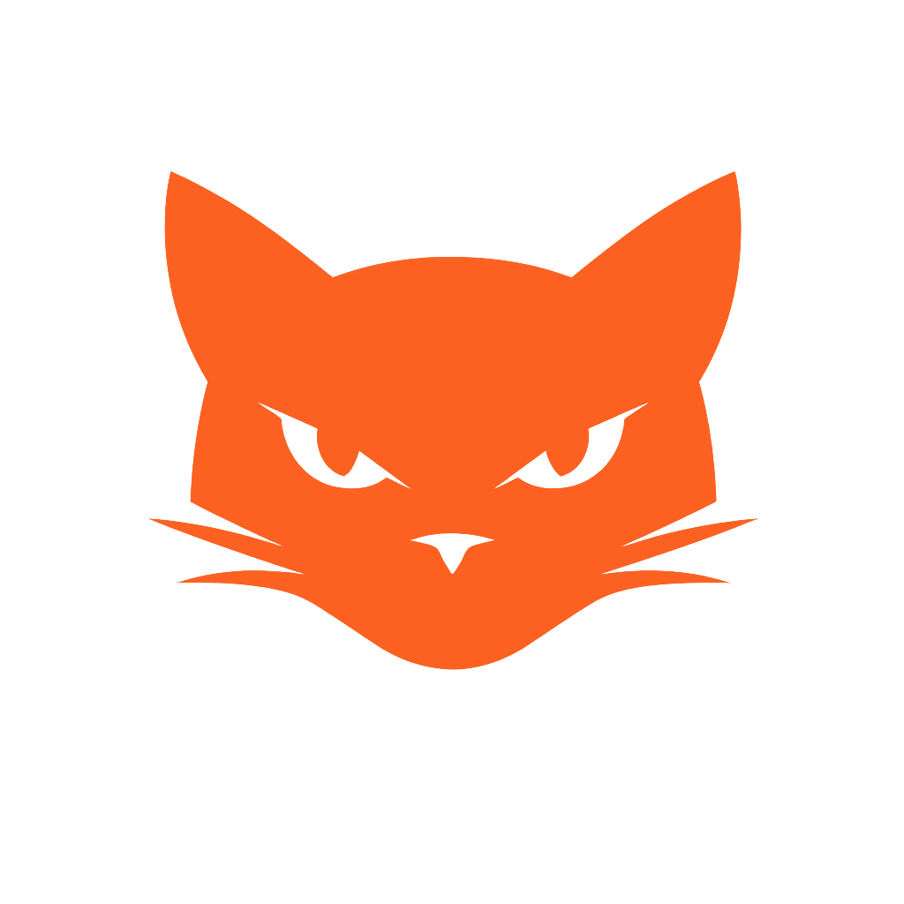

<div align="center">
  
  <h1>Video<font color="#FC6121">CAT</font></h1>
  <p><strong>Private video catalog for external drives, with a Windows companion app.</strong></p>

  <p>
    <a href="README.md">Español</a>
  </p>

  <p>
    <a href="https://videocat.centeran.com"></a>
    <a href="https://github.com/reiterstahl/videocat/releases/latest"></a>
    <a href="https://github.com/reiterstahl/videocat/releases/latest"></a>
    <a href="https://github.com/reiterstahl/videocat/blob/main/LICENSE"></a>
    <a href="https://github.com/sponsors/reiterstahl"></a>
  </p>

  <p>
    
    
    
    
    
  </p>
</div>

VideoCAT is a private catalog for videos stored on external hard drives. It is designed for collections spread across many drives that are not always connected: it indexes metadata, paths, thumbnails, tags, duplicates and review decisions without copying the original videos to the server.

The system has two parts:

- A Docker Compose web platform: `postgres`, `server` and `web`.
- A Windows companion app that lives in the system tray, detects drives, scans files, opens local files and processes pending deletes.

> VideoCAT can physically delete files from Windows when a video is marked for deletion and the companion is running. Use this feature only if you understand the review flow.

## Features

- Private web catalog with username/password login.
- Responsive UI with dark mode, sticky navigation, search, filters and persistent pagination.
- Reverse proxy support, secure cookies and custom domain deployment.
- Resilient drive identification through `.videocat-disk.json` at the drive root.
- Scanning still works when Windows changes the drive letter.
- Connected-drive selection to work only with the currently available subset.
- Filters by drive, extension, folders, tags, categories and duplicates.
- Collapsible folder tree with lazy subfolder expansion.
- Accent-tolerant and partial search across filename and relative path.
- Sortable table columns, configurable page size and result count.
- Thumbnails and distributed frame gallery for each video.
- Detail modal with keyboard navigation, full-screen image gallery and local open actions.
- Last indexed timestamp per video.
- Folder-size value for the folder containing each video.
- Folder usage screen to understand space distribution.
- Probable duplicate detection by file size, visually grouped.
- Dedicated duplicate review section.
- Automatic tags based on filenames.
- Custom multi-category labels with colors.
- Built-in review categories: `Mantener`, `Marcado para borrar`, `Por revisar`, `SH` and user-defined categories.
- Random review flow for pending videos, filtered by selected/connected drives.
- Review indicators: pending count, marked today, weekly streak and freed GB.
- Recoverable-space modal that recommends which drive to connect to free the most space.
- `A descargar` download queue to copy selected videos from connected drives into a local folder.
- Random selection by target GB amount to fill the download queue with available videos.
- Per-file copy progress, one-at-a-time processing, pause, clear queue and manual process controls.
- Year/month download tags to avoid randomly selecting already downloaded videos again.
- Deferred physical deletion of marked files when the drive is connected again.
- Audit section for scan, metadata, thumbnail and delete errors.
- Admin section to remove a drive's cataloged content.
- Profile section to configure the security PIN and protected folder patterns.
- PIN protection for folders matching configurable patterns.
- Protected folders are excluded from duplicate calculations.
- System folders such as `$RECYCLE.BIN` and `System Volume Information` are skipped.
- Bilingual Spanish/English interface, with a language selector and optional support links in the official distribution.

## Windows Companion

The companion turns the agent into a Windows tray app. It lets you use VideoCAT without opening a terminal.

Main features:

- Runs in the background from the Windows system tray.
- Starts and keeps the local companion active.
- Configures `SERVER_URL`, `WEB_URL`, `AGENT_TOKEN` and local options from a window.
- Shows a live activity/log window.
- Detects mounted drives that contain `.videocat-disk.json`.
- Lets you add local/network drives or folders as monitored paths from the companion configuration.
- Lets you stop monitoring manual paths and ignore detected VideoCAT drives without deleting their marker.
- Periodically checks for newly connected drives.
- Periodically rescans monitored paths to detect new content.
- Scans drives or paths on demand.
- Processes pending deletes automatically.
- Processes the `A descargar` queue, copying files into the configured local folder.
- Opens videos with the default video player.
- Opens the local folder for a file.
- Reports status to the web UI so the site can show whether the companion is synced.
- Deletes files only when the correct drive is connected and the path is safe.

## Current Release

The first public release is `v0.1.0`.

- Source code: <https://github.com/reiterstahl/videocat>
- Project website: <https://videocat.centeran.com>
- Release: <https://github.com/reiterstahl/videocat/releases/latest>
- Windows Companion: `VideoCAT-Companion-0.1.0.exe`

Recommended companion verification:

```text
SHA-256: 057dc8fa22834ea9c0bb4de5b2abe612bddc6446395c20e65154bfa820250b5b
MD5:     54d481f48c27b7a91d9a6c17e1b655eb
```

On Windows:

```powershell
Get-FileHash .\VideoCAT-Companion-0.1.0.exe -Algorithm SHA256
```

## Stack

- TypeScript monorepo with npm workspaces.
- Fastify + Prisma + PostgreSQL backend.
- React + Vite + Nginx web app.
- Windows agent/companion with Node.js, Electron, `ffprobe` and `ffmpeg`.
- Docker Compose for server, web and database.

## Quick Start With Docker Compose

Requirements:

- Docker and Docker Compose.
- Node.js only if you plan to develop or build the Windows companion.
- `ffmpeg` and `ffprobe` on Windows for scanning.

1. Copy the environment example:

```bash
cp .env.example .env
```

2. Edit `.env` and change at least:

```env
POSTGRES_PASSWORD=replace-with-64-hex-random-characters
JWT_SECRET=replace-with-64-hex-random-characters
AGENT_TOKEN=replace-with-64-hex-random-characters
PROTECTED_FOLDER_PIN=replace-with-4-digit-pin
PROTECTED_FOLDER_PATTERNS=Private,Protected
ADMIN_USER=admin
ADMIN_PASSWORD=replace-with-a-long-unique-password
```

You can generate secrets with:

```bash
openssl rand -hex 32
```

3. Start the platform:

```bash
docker compose up -d --build
```

4. Open the web app:

```text
http://localhost:8081
```

Default services:

- Web: `http://localhost:8081`
- Locally published API: `http://127.0.0.1:4001`
- PostgreSQL: internal Docker network
- Thumbnails: persistent `thumbnails_data` volume

## Reverse Proxy

The recommended setup is to expose the `web` container to your reverse proxy. That container serves React and internally proxies:

- `/api/*` to `server:4000`
- `/thumbnails/*` to `server:4000`

Recommended variables:

```env
WEB_ORIGIN=https://cat.example.com
WEB_BIND_ADDR=0.0.0.0
WEB_PUBLISHED_PORT=8081
SERVER_BIND_ADDR=127.0.0.1
SERVER_PUBLISHED_PORT=4001
TRUST_PROXY=true
COOKIE_SECURE=true
PUBLIC_THUMBNAILS_BASE_URL=/thumbnails
```

External Nginx example:

```nginx
server {
  server_name cat.example.com;

  client_max_body_size 25m;

  location / {
    proxy_pass http://127.0.0.1:8081;
    proxy_http_version 1.1;
    proxy_set_header Host $host;
    proxy_set_header X-Real-IP $remote_addr;
    proxy_set_header X-Forwarded-For $proxy_add_x_forwarded_for;
    proxy_set_header X-Forwarded-Host $host;
    proxy_set_header X-Forwarded-Proto $scheme;
  }
}
```

For local HTTP testing you can use `COOKIE_SECURE=false`. In production with HTTPS, keep it `true`.

## Windows CLI Agent

Requirements:

- Node.js 20 or newer.
- `ffmpeg` and `ffprobe` available in `PATH`.
- External drive mounted and manually unlocked if it uses BitLocker.

Install:

```powershell
cd C:\Users\reite\Documents\videocat
npm install
```

Configure variables in `apps\agent-windows\.env`:

```env
SERVER_URL=https://cat.example.com
WEB_URL=https://cat.example.com
AGENT_TOKEN=replace-with-agent-token
AGENT_CONCURRENCY=2
COMPANION_PORT=29429
COMPANION_ALLOWED_ORIGINS=https://cat.example.com,http://localhost:5173,http://127.0.0.1:5173
COMPANION_DISK_POLL_MS=5000
COMPANION_SCAN_POLL_MS=900000
COMPANION_DELETE_POLL_MS=60000
TRAY_DISK_POLL_MS=10000
COMPANION_AUTO_DELETE_MARKED=true
# Usually edited from the companion configuration window.
COMPANION_MONITORED_TARGETS=[]
COMPANION_DISABLED_DISK_IDS=
# Optional: if set, the web app must send the same local token.
# COMPANION_TOKEN=replace-with-local-token
```

Wizard mode:

```powershell
npm run wizard -w @videocat/agent-windows
```

Direct scan:

```powershell
npm run scan -w @videocat/agent-windows -- --path "E:" --disk-name "WD 6TB Video 01"
```

Initialize a drive with a stable identifier:

```powershell
npm run init-disk -w @videocat/agent-windows -- --path "E:" --disk-name "WD 6TB Video 01" --scan-root "Videos"
```

This creates:

```text
E:\.videocat-disk.json
```

That file contains the `diskId`, friendly name and internal scan roots. If Windows changes the drive letter, VideoCAT can still recognize it.

Add another scan root:

```powershell
npm run add-root -w @videocat/agent-windows -- --path "E:" --scan-root "Archive/Clients"
```

Discover marked drives:

```powershell
npm run discover -w @videocat/agent-windows
```

## Portable Windows Companion

Build the executable:

```powershell
npm install
npm run package:tray -w @videocat/agent-windows
```

The executable is created at:

```text
apps\agent-windows\release\VideoCAT-Companion-0.1.0.exe
```

Usage:

1. Open the executable.
2. Right-click the tray icon.
3. Open `Configuración...`.
4. Save `SERVER_URL`, `WEB_URL` and `AGENT_TOKEN`.
5. Use `Ver actividad...` to inspect live logs.
6. Connect drives marked with `.videocat-disk.json`.

## Review And Delete Flow

1. In the web app, open `Review`.
2. Use `Iniciar Review` to get a random pending video.
3. You can assign additional categories while reviewing.
4. `Mantener` marks the video as kept.
5. `Borrar` marks the video as `Marcado para borrar`.
6. The file is not deleted immediately by the server.
7. When the correct drive is connected and the companion is active, the companion processes pending deletes.
8. The freed GB counter increases as files are physically deleted.

If you use `Mostrar conectados`, Review picks random videos only from the selected/connected drives.

## Security And Privacy

- The web app requires login.
- Agent routes are protected by `AGENT_TOKEN`.
- The local companion can be protected with `COMPANION_TOKEN`.
- Secure cookies and `TRUST_PROXY` are supported for HTTPS deployments.
- Folders matching `PROTECTED_FOLDER_PATTERNS` require a PIN in the web session.
- The server does not need direct access to your external drives.
- Original videos are not uploaded to the server.
- Metadata, relative paths, thumbnails and audit errors are uploaded.
- Physical deletion happens only on Windows, through the companion, when the drive is connected.

`PROTECTED_FOLDER_PATTERNS` is a comma-separated list. For a public or generic installation, use values such as `Private,Protected`. For a private deployment, set it to the real folder-name fragments you want to protect without changing the code.

## Backups

Back up:

- PostgreSQL database.
- `thumbnails_data` volume.
- `.env` file.
- Optionally the local companion `.env`.

Example:

```bash
docker compose exec postgres pg_dump -U videocat videocat > videocat.sql
```

## Updating

Server:

```bash
git pull
npm install
docker compose up -d --build server web
```

If database changes exist, the `server` container runs `prisma migrate deploy` on startup.

Windows companion:

```powershell
git pull
npm install
npm run package:tray -w @videocat/agent-windows
```

## Local Development

```bash
npm install
npm run prisma:generate
npm run dev:server
npm run dev:web
```

The Vite web app runs at:

```text
http://localhost:5173
```

## Docker Hub Images

The fastest way to try VideoCAT with prebuilt images is:

```bash
curl -fsSL https://raw.githubusercontent.com/reiterstahl/videocat/main/install.sh | sh
```

The installer creates a `videocat` folder, downloads `docker-compose.hub.yml`, generates secrets in `.env`, pulls the images and starts the stack.

Then open:

```text
http://localhost:8081
```

Official images:

```text
reiterstahl/videocat-server:0.1.0
reiterstahl/videocat-web:0.1.0
```

`latest` tags are also published:

```text
reiterstahl/videocat-server:latest
reiterstahl/videocat-web:latest
```

Manual installation:

```bash
mkdir videocat
cd videocat
curl -fsSLO https://raw.githubusercontent.com/reiterstahl/videocat/main/docker-compose.hub.yml
curl -fsSLO https://raw.githubusercontent.com/reiterstahl/videocat/main/.env.example
mv .env.example .env
```

Edit `.env`, change the secrets and for local HTTP testing use:

```env
WEB_ORIGIN=http://localhost:8081
COOKIE_SECURE=false
```

Start the stack:

```bash
docker compose -f docker-compose.hub.yml up -d
```

To publish new official images:

```bash
docker buildx build --platform linux/amd64,linux/arm64 -f apps/server/Dockerfile -t reiterstahl/videocat-server:0.1.0 -t reiterstahl/videocat-server:latest --push .
docker buildx build --platform linux/amd64,linux/arm64 -f apps/web/Dockerfile -t reiterstahl/videocat-web:0.1.0 -t reiterstahl/videocat-web:latest --push .
```

The main `docker-compose.yml` still builds locally with `build`, which is useful for development:

```bash
docker compose up -d --build
```

The Docker Hub compose file uses:

```yaml
server:
  image: reiterstahl/videocat-server:0.1.0

web:
  image: reiterstahl/videocat-web:0.1.0
```

## Main Endpoints

Agent:

- `POST /api/agent/register-disk`
- `POST /api/agent/scan/start`
- `POST /api/agent/files/batch`
- `POST /api/agent/thumbnails/upload`
- `POST /api/agent/scan/finish`
- `POST /api/agent/audit/errors`

Web:

- `POST /api/auth/login`
- `POST /api/auth/logout`
- `GET /api/files`
- `GET /api/files/:id`
- `GET /api/disks`
- `GET /api/facets`
- `GET /api/duplicates/by-size`
- `GET /api/folder-usage`
- `GET /api/audit/errors`
- `GET /api/review/summary`
- `GET /api/review/next`
- `GET /api/review/recoverable-space`
- `GET /api/profile/security`
- `PATCH /api/profile/security`

## License And Support

VideoCAT is distributed under the `AGPL-3.0-or-later` license. This license allows using, studying, modifying, distributing and publishing derived versions of the project while preserving the copyleft and attribution obligations required by the license.

The official distribution includes optional support links for the original author. Forks and modified versions may remove or replace those links, provided they comply with the project license and preserve required copyright and attribution notices.

Before publishing an open source release:

- Ensure no real `.env` file is committed.
- Replace private domains with examples.
- Add screenshots.
- Publish a release with the companion `.exe`.
- Optionally automate Docker Hub images and GitHub releases with GitHub Actions.
