<div align="center">
  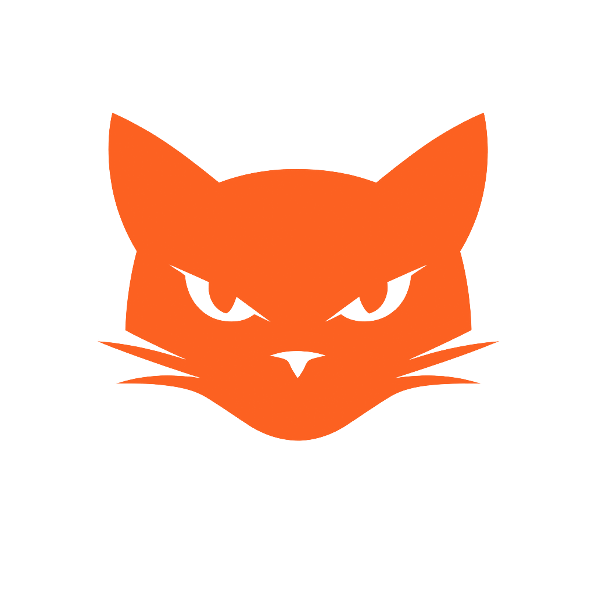
  <h1>Video<font color="#FC6121">CAT</font></h1>
  <p><strong>A private catalog for videos spread across external drives, with a Windows Companion.</strong></p>

  <p>
    <a href="README.md">Español</a> · <strong>English</strong>
  </p>

  <p>
    <a href="https://videocat.centeran.com"></a>
    <a href="https://github.com/reiterstahl/videocat/releases/latest"></a>
    <a href="https://hub.docker.com/r/reiterstahl/videocat-web"></a>
    <a href="https://github.com/reiterstahl/videocat/actions/workflows/ci.yml"></a>
    <a href="https://github.com/reiterstahl/videocat/releases/latest/download/VideoCAT-Companion-win-Setup.exe"></a>
    <a href="https://github.com/reiterstahl/videocat/blob/main/LICENSE"></a>
    <a href="https://github.com/sponsors/reiterstahl"></a>
  </p>
</div>

VideoCAT indexes the videos on your external drives — even ones that are rarely plugged in — and lets you search, review, find duplicates, play remotely and free up space from a browser or your phone. **Your videos never leave your drives:** the server only stores metadata, relative paths and thumbnails.

<p align="center">
  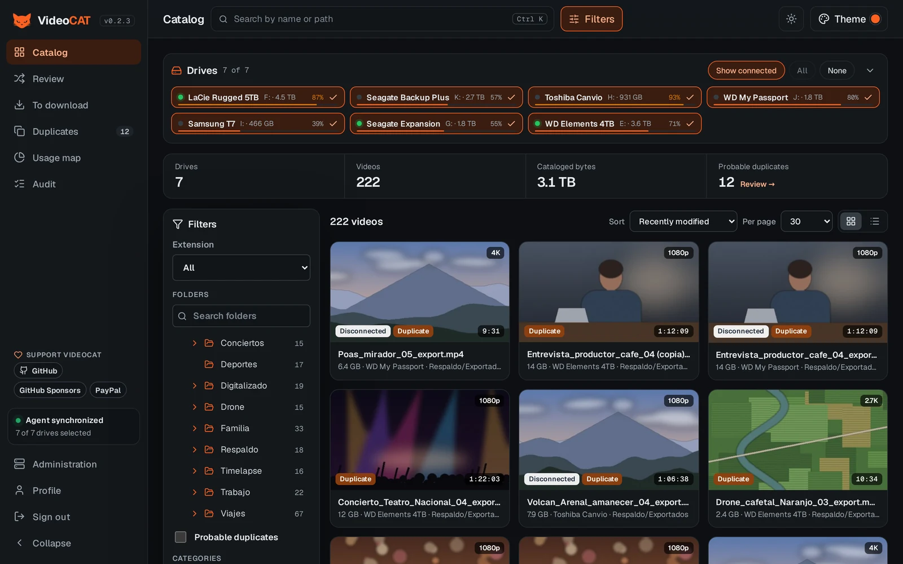
</p>

> [!WARNING]
> VideoCAT can **physically delete files** on Windows: when you mark a video for deletion, the Companion removes it once the right drive is connected. Before using it with important footage, read [Review and safe deletion](#review-and-safe-deletion).

## Contents

- [How it works](#how-it-works)
- [Features](#features)
- [Quick start](#quick-start)
- [Everyday use](#everyday-use)
- [Production deployment](#production-deployment)
- [Security and privacy](#security-and-privacy)
- [Companion configuration](#companion-configuration)
- [Development](#development)
- [Publishing releases](#publishing-releases)
- [Related documentation](#related-documentation)
- [License and support](#license-and-support)

## How it works

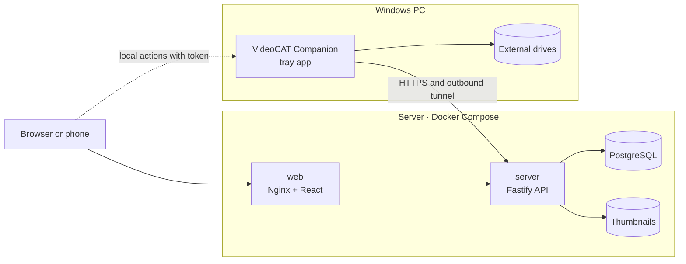
```mermaid
flowchart LR
  browser["Browser or phone"] --> web
  subgraph server_host["Server · Docker Compose"]
    web["web<br/>Nginx + React"] --> api["server<br/>Fastify API"]
    api --> db[("PostgreSQL")]
    api --> thumbs[("Thumbnails")]
  end
  subgraph windows["Windows PC"]
    companion["VideoCAT Companion<br/>tray app"] --> disks[("External drives")]
  end
  companion -- "HTTPS and outbound tunnel" --> api
  browser -. "local actions with token" .-> companion
```

| Piece | What it does |
| --- | --- |
| **web** | Serves the React app and proxies the API and thumbnails. It is the only thing you expose through your reverse proxy. |
| **server** | API for login, catalog, review, duplicates, audit and the Companion tunnel. Applies database migrations on start. |
| **postgres** | Catalog database, reachable only on the internal Docker network. |
| **Companion** | Windows tray app: detects drives, scans with FFmpeg, uploads metadata and thumbnails, processes deletions and copies, and serves remote playback through an **outbound** tunnel (no open ports). |

## Features

### Catalog
- Grid or list view, accent-insensitive search with `Ctrl K`, active filter chips and a detail panel.
- Filters by drive, extension, folder (lazy-loaded tree), tags, categories and duplicates.
- Drive strip with capacity and usage, plus **Show connected** to work only with what is plugged in.
- Drives are identified by `.videocat-disk.json`, so they are recognized even when Windows changes the drive letter.
- Thumbnails, a 15-frame gallery per video, folder size and last indexed date.

### Review
- Immersive full-screen session with random pending videos, optionally limited to connected drives.
- Left- and right-hand shortcuts: **F** keeps, **J** marks for deletion, plus skip, undo and numbered tags.
- Single-frame view or a **gallery** with every thumbnail at once.
- On phones: an animated confirmation for each decision, the file name always visible and an automatic jump back to the top.
- The next video is preloaded; counters show pending videos, the weekly streak and space marked to free.

### Duplicates
- Detection by size and by **perceptual visual fingerprints** taken at 15 points, which match copies with a different resolution, codec or compression.
- Confidence level, reasons and recoverable space per group.
- Assisted mode with side-by-side comparison, a recommendation based on resolution, size and duration, and one-click or one-key decisions.
- Drives ranked by recoverable duplicate space.

### Remote playback
- Watch any video from your phone or another browser through the Companion's outbound tunnel, without sharing Windows paths or mounting drives on the server.
- Touch-friendly player: double-tap to seek, next video and shuffle across connected drives.
- Optional temporary MP4 remux for H.264/AAC in unsupported containers. Optional Chromecast with signed, short-lived links.

### To download
- A queue that copies videos from connected drives to a local Windows folder, with per-file progress, pause and clear.
- Random selection by target size in GB, limited to drives or folders, without repeating what was already downloaded.

### Organization, administration and audit
- Custom colored categories, several per video, and automatic tags from file names.
- **Usage map**: a folder map by size you can drill into.
- Administration with physical and cataloged space per drive, paired Companions, recent activity and cleanup.
- Audit of grouped errors and actions, with search, filters and CSV export.
- PIN-protected folders matched by name patterns, excluded from duplicate detection.

### Interface
- Spanish and English, light, dark, OLED or system themes, six accent colors and comfortable or compact density.
- Responsive: collapsible sidebar on desktop, tab bar and bottom sheets on phones.
- Every section has its own URL (`/catalogo`, `/review`, `/duplicados`…), also reachable through its English equivalent.

### Windows Companion
- Installs with a Setup.exe, without administrator rights, and **updates itself** from GitHub Releases.
- Pairs with a one-time code and keeps an individual credential encrypted by Windows.
- Monitors marked drives and manually added paths, and rescans periodically without repeating work.
- Reconciles missing files without losing tags or history, and reactivates them if they come back.
- Before deleting, it revalidates size, modification time and visual fingerprint; if the path now holds a different file, it cancels.

<details>
<summary><strong>More screenshots</strong></summary>

| Review | Assisted duplicates |
| --- | --- |
| 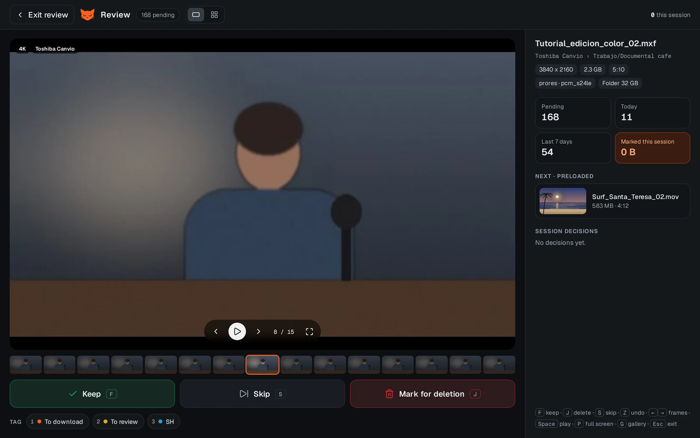 | 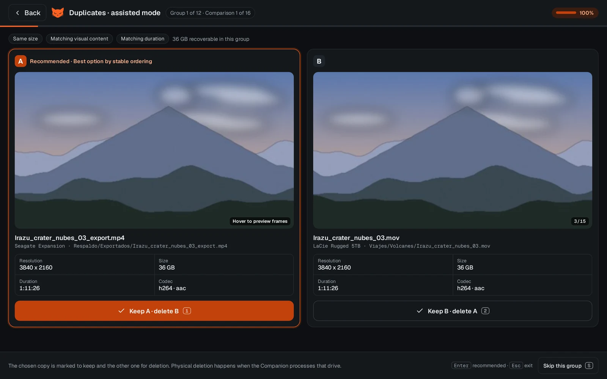 |

| To download | Usage map |
| --- | --- |
| 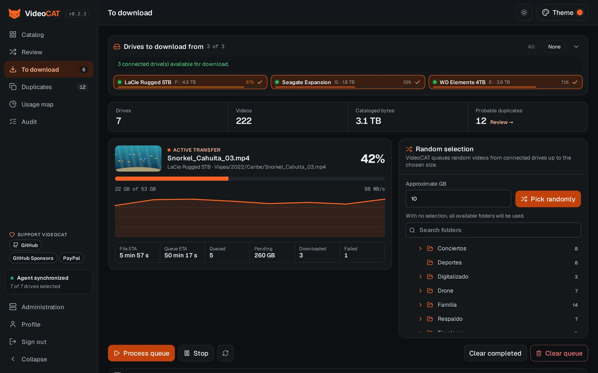 | 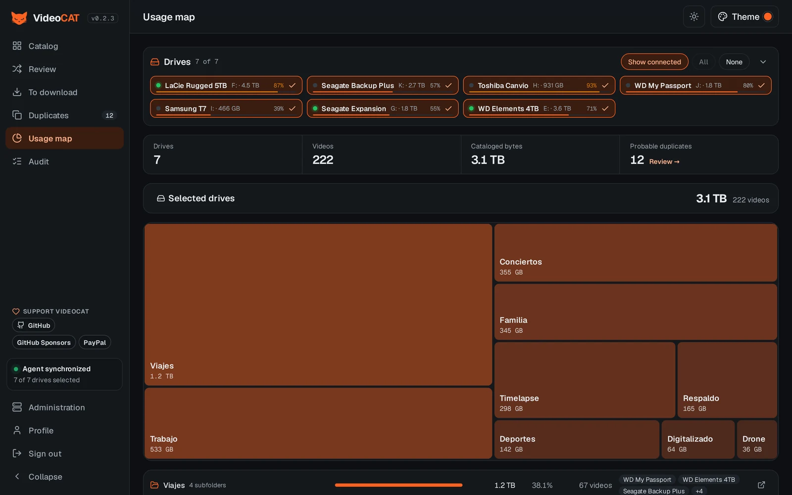 |

| Administration | Windows Companion |
| --- | --- |
| 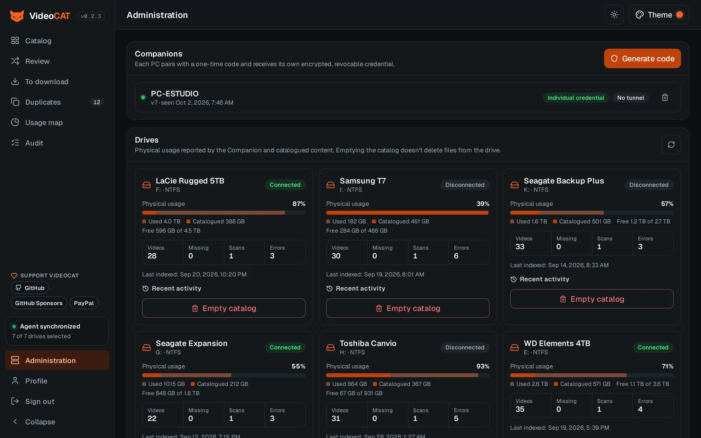 | 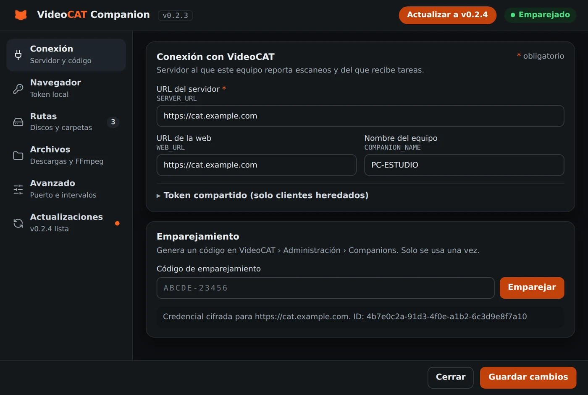 |

<p align="center">
  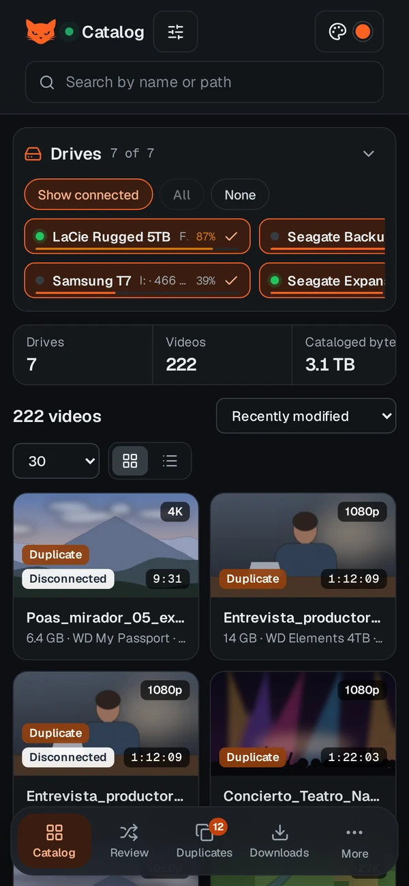
  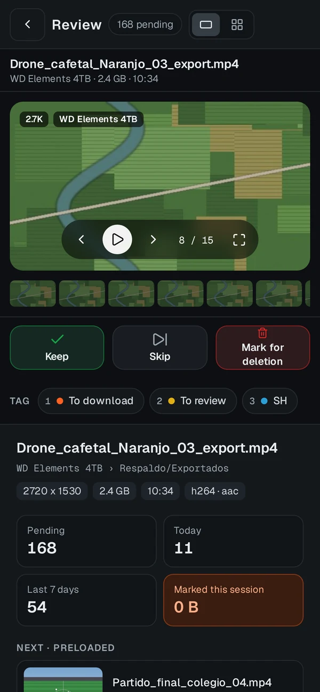
  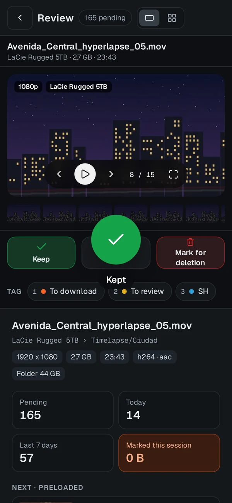
</p>

All screenshots use fictional data.
</details>

## Quick start

### 1. Server with Docker

You need Docker with Compose. The installer creates a `videocat` folder, downloads `docker-compose.hub.yml`, generates secrets in `.env` and starts the stack with the official images.

Linux, macOS or WSL:

```bash
curl -fsSL https://raw.githubusercontent.com/reiterstahl/videocat/main/install.sh | sh
```

Windows PowerShell with Docker Desktop:

```powershell
powershell -ExecutionPolicy Bypass -Command "irm https://raw.githubusercontent.com/reiterstahl/videocat/main/install.ps1 | iex"
```

Open `http://localhost:8081` and sign in as `admin` with the password the installer prints (it is also stored in `videocat/.env`).

<details>
<summary>Manual installation with the Docker Hub images</summary>

```bash
mkdir videocat && cd videocat
curl -fsSLO https://raw.githubusercontent.com/reiterstahl/videocat/main/docker-compose.hub.yml
curl -fsSL https://raw.githubusercontent.com/reiterstahl/videocat/main/.env.example -o .env
```

Edit `.env` and replace every `replace-with-…` value. Generate each secret with `openssl rand -hex 32`. For local testing without HTTPS, use `WEB_ORIGIN=http://localhost:8081` and `COOKIE_SECURE=false`. Then:

```bash
docker compose -f docker-compose.hub.yml up -d
```

Official images (amd64 and arm64): `reiterstahl/videocat-server` and `reiterstahl/videocat-web`, tagged by version (`0.2.3`) and `latest`.
</details>

### 2. Windows Companion

1. Install FFmpeg, which the Companion uses to read metadata and create thumbnails. It is found automatically when installed with WinGet, Scoop or Chocolatey, or in `C:\ffmpeg\bin`:

   ```powershell
   winget install Gyan.FFmpeg
   ```

2. Download and run [**VideoCAT-Companion-win-Setup.exe**](https://github.com/reiterstahl/videocat/releases/latest/download/VideoCAT-Companion-win-Setup.exe), then open it from the Start menu. It lives in the system tray.
3. In the web app, open **Administration › Companions** and generate a pairing code.
4. In the Companion, open **Configuración… › Conexión**, enter the server URL, paste the code and select **Emparejar**.
5. In **Configuración… › Navegador**, copy the local token and paste it in the web app under **Profile › Local Companion**. That browser can then open, copy and delete files on this PC.

> [!TIP]
> If you used the portable `.exe` (0.2.2 or earlier), close it, install with Setup.exe and delete the portable file: settings and pairing are kept in `%APPDATA%\VideoCAT Companion`.

The Companion's own windows are in Spanish; the names in parentheses below are their English meaning.

### 3. Your drives

From the Companion's **Configuración… › Rutas** (Settings › Paths) you can:

- **Añadir unidad…** or **Añadir carpeta…** (add a drive or a local/network folder) to monitor and scan it automatically.
- See the **detected VideoCAT drives**: those with a `.videocat-disk.json` file at their root. The marker gives them a stable identity even if the drive letter changes, and lets you choose which inner folders to scan.

To create the marker, use the [CLI agent](#cli-agent) (`init-disk` or `wizard`) or create the file by hand at the drive root:

```json
{
  "schemaVersion": 1,
  "diskId": "generate-a-uuid-v4",
  "diskName": "WD 6TB Video 01",
  "createdAt": "2026-10-02T00:00:00.000Z",
  "scanRoots": ["."]
}
```

The first scan uploads metadata and thumbnails. Later scans only process new or changed files.

## Everyday use

### Review and safe deletion

1. Open **Review** and select **Start Review**. With **Show connected**, only videos from plugged-in drives appear.
2. Decide with the buttons or the keyboard. You can assign categories while reviewing.
3. **Mark for deletion** deletes nothing on the server: the video goes to the *Marked for deletion* category.
4. When the right drive is connected and the Companion is running, it deletes the pending files. It first revalidates size, modification time and visual fingerprint, and resolves the canonical path so it never follows links or junctions.
5. The history records date, drive, path and size for every deletion or failure, and the freed-space counter updates.

If you would rather the Companion not delete on its own, set **Borrar los marcados** (delete marked files) to *Solo a pedido* (on request only) in **Configuración… › Avanzado**.

| Key | Review action |
| --- | --- |
| `F` | Keep |
| `J` | Mark for deletion |
| `S` | Skip |
| `Z` | Undo the last decision |
| `1`–`9` | Toggle a tag |
| `←` `→` | Previous or next frame |
| `Space` | Play the frames |
| `G` | Switch between frame and gallery |
| `P` | Full screen |
| `Esc` | Exit |

In **Duplicates › Start assisted mode**: `1` or `←` keeps copy A and marks B for deletion, `2` or `→` does the opposite, `Enter` applies the recommendation, `S` skips the group and `Esc` exits.

### Remote playback and Chromecast

The player first checks whether the browser supports the container and codecs. For H.264 videos with AAC or MP3 audio in an unsupported container, you can enable a **temporary MP4 remux**, which copies the streams without re-encoding:

1. On the server, set `REMOTE_REMUX_ENABLED=true` and restart `server`.
2. In the Companion, turn on **Remux MP4 temporal** in **Configuración… › Avanzado**.

VideoCAT does not transcode H.265, AV1 or other codecs, because that would use a lot of CPU. Each session belongs to the user who created it, has duration, idle and concurrency limits, and closes when the player stops or the tunnel drops.

Chromecast is off by default: enable it in **Profile**. The Google Cast SDK only loads when you use the button, and the receiver gets a signed, short-lived URL, never your credentials. The Chromecast must be able to reach VideoCAT's domain or IP.

## Production deployment

### Server variables

The main `.env` settings (the full, commented list is in [`.env.example`](.env.example)):

| Variable | Purpose |
| --- | --- |
| `POSTGRES_PASSWORD`, `JWT_SECRET`, `AGENT_TOKEN` | Secrets. Generate each one with `openssl rand -hex 32`. |
| `ADMIN_USER`, `ADMIN_PASSWORD` | Web app user. |
| `WEB_ORIGIN` | Exact public URL (for example `https://cat.example.com`). Writes from any other origin are rejected. |
| `COOKIE_SECURE` | `true` with HTTPS; `false` only for local testing. |
| `TRUST_PROXY`, `TRUST_PROXY_CIDRS` | Trust in the reverse proxy; preferably limited to its CIDRs. |
| `WEB_BIND_ADDR`, `WEB_PUBLISHED_PORT` | Where the `web` container is published (default `0.0.0.0:8081`). |
| `PROTECTED_FOLDER_PIN`, `PROTECTED_FOLDER_PATTERNS` | PIN and folder-name fragments to protect (for example `Private,Protected`). |
| `VIDEOCAT_VERSION` | Image version used by `docker-compose.hub.yml` (`0.2.3` or `latest`). |
| `REMOTE_REMUX_ENABLED`, `REMOTE_STREAM_*` | Optional remux and remote playback limits. |
| `*_RETENTION_DAYS` | Retention for errors, actions and scans when cleanup runs from Administration. |

### Reverse proxy

Expose only the `web` container: it already proxies `/api/*` and `/thumbnails/*` to `server:4000` and forwards the tunnel WebSocket. Your external proxy must also allow `Upgrade` on `/api/agent/tunnel`. Nginx example:

```nginx
map $http_upgrade $connection_upgrade {
  default upgrade;
  ''      close;
}

server {
  server_name cat.example.com;
  client_max_body_size 25m;

  location / {
    proxy_pass http://127.0.0.1:8081;
    proxy_http_version 1.1;
    proxy_set_header Host $host;
    proxy_set_header X-Real-IP $remote_addr;
    proxy_set_header X-Forwarded-For $proxy_add_x_forwarded_for;
    proxy_set_header X-Forwarded-Host $host;
    proxy_set_header X-Forwarded-Proto $scheme;
    proxy_set_header Upgrade $http_upgrade;
    proxy_set_header Connection $connection_upgrade;
  }
}
```

With HTTPS, use `WEB_ORIGIN=https://cat.example.com`, `COOKIE_SECURE=true` and `TRUST_PROXY=true`.

### Updating

- **Server:** set `VIDEOCAT_VERSION` (or use `latest`) and run `docker compose -f docker-compose.hub.yml pull && docker compose -f docker-compose.hub.yml up -d`. Migrations run on start, and the `thumbnails-init` service fixes the thumbnail volume's permissions. In Portainer: *Pull and redeploy*.
- **Companion:** updates itself. It checks for new versions a minute after starting and then every 6 hours, downloads them in the background and applies them on restart. You can also apply them with **Reiniciar para actualizar** (restart to update) in the tray or force a check with **Buscar actualizaciones** (check for updates).
- The web app shows a notice next to the logo when Docker Hub has a newer stack version.

Release notes for each version are in [OPERATIONS.md](OPERATIONS.md#upgrade).

### Backups

`scripts/backup.sh` (or `scripts/backup.ps1`) saves the database, the thumbnail volume, checksums and `.env`. `scripts/verify-backup.sh` checks a backup and `scripts/restore.sh` restores it. Keep backups encrypted: they contain private paths and metadata. Details and a restore drill are in [OPERATIONS.md](OPERATIONS.md).

## Security and privacy

**Your data**
- Original videos never leave your drives. Only metadata, relative paths, validated JPEG thumbnails and audit errors are uploaded.
- The server needs no access to your drives. Physical deletion only happens on Windows, by the Companion, with the right drive connected.
- Folders whose name matches `PROTECTED_FOLDER_PATTERNS` require a PIN in each session and are left out of duplicate detection.

**Companion**
- Each installation uses an individual credential, paired with a one-time code, encrypted with the Windows user's protection and revocable from Administration. The server only stores its hash.
- The tunnel is outbound and authenticated, and only serves reads through HTTP Range: it accepts no remote writes.
- The local listener only answers `/health` without authentication. Opening, copying, deleting and processing queues require `COMPANION_TOKEN`.
- Paths are resolved canonically before opening, copying or deleting, and downloads never overwrite an existing file.
- Updates come from GitHub Releases with a SHA-256 checksum, a provenance attestation and an SBOM.

**Web and API**
- Sign-in uses fixed-algorithm JWTs that expire after 12 hours, and writes are validated against `WEB_ORIGIN`.
- Body and time limits, rate limiting, no-cache sensitive responses, and CSP and HSTS (under HTTPS) from Nginx and Fastify.
- Non-root containers with a read-only file system and no capabilities.

**Project**
- On every change to `main` and every pull request, CI runs a clean install, a dependency audit, type checks, unit and API tests against PostgreSQL, coverage thresholds, the build and Playwright UI tests on desktop and mobile.
- Dependabot checks npm dependencies, base images and GitHub Actions every week.

To report a vulnerability privately, see [SECURITY.md](SECURITY.md).

## Companion configuration

Everything is edited from **Configuración…**, organized in pages: Conexión, Navegador, Rutas, Archivos, Avanzado and Actualizaciones (connection, browser, paths, files, advanced and updates). It is stored in `%APPDATA%\VideoCAT Companion\.env`.

<details>
<summary>Companion variables</summary>

| Variable | Default | Use |
| --- | --- | --- |
| `SERVER_URL` | — | VideoCAT server URL (required). |
| `WEB_URL` | `SERVER_URL` | URL opened by **Abrir VideoCAT**. |
| `COMPANION_NAME` | — | Optional name shown in Administration. |
| `COMPANION_TOKEN` | Generated | Token for local actions; paste it in Profile › Local Companion. |
| `AGENT_TOKEN` | — | Shared token, only for legacy unpaired clients. |
| `COMPANION_DOWNLOAD_DIR` | — | Destination folder for **To download**. |
| `FFMPEG_PATH`, `FFPROBE_PATH` | Auto-detected | FFmpeg paths when they are not found automatically. |
| `AGENT_STATE_DIR` | `%LOCALAPPDATA%\VideoCAT\agent-state` | Local scan state. |
| `COMPANION_PORT` | `29429` | Local port (`127.0.0.1` only). |
| `COMPANION_ALLOWED_ORIGINS` | — | Web origins allowed to call the local listener. |
| `COMPANION_AUTO_DELETE_MARKED` | `true` | Delete marked files automatically or only on request. |
| `COMPANION_REMOTE_REMUX_ENABLED` | `false` | Temporary MP4 remux for remote playback. |
| `COMPANION_DISK_POLL_MS` | `5000` | Drive detection. |
| `COMPANION_SCAN_POLL_MS` | `900000` | Rescan of monitored paths. |
| `COMPANION_HEARTBEAT_MS` | `15000` | Heartbeat to the server. |
| `COMPANION_DELETE_POLL_MS` | `60000` | Check for pending deletions. |
| `COMPANION_DOWNLOAD_POLL_MS` | `60000` | Check of the download queue. |
| `COMPANION_DOWNLOAD_STALL_MS` | `30000` | Time before a copy counts as stalled. |
| `TRAY_DISK_POLL_MS` | `10000` | Drive refresh in the tray menu. |
</details>

### CLI agent

The same agent runs from the command line inside the repository (Node.js 22 or later, 24 LTS recommended, with FFmpeg on `PATH`). It reads the same settings from `apps\agent-windows\.env`.

```powershell
npm install
npm run wizard -w @videocat/agent-windows                       # interactive assistant
npm run init-disk -w @videocat/agent-windows -- --path "E:" --disk-name "WD 6TB Video 01" --scan-root "Videos"
npm run add-root -w @videocat/agent-windows -- --path "E:" --scan-root "Archive/Clients"
npm run scan -w @videocat/agent-windows -- --path "E:" --disk-name "WD 6TB Video 01"
npm run discover -w @videocat/agent-windows                     # lists marked drives
```

## Development

TypeScript monorepo with npm workspaces (Node.js 22 or later):

| Folder | Contents |
| --- | --- |
| `apps/server` | Fastify API + Prisma + PostgreSQL. |
| `apps/web` | React 18 + Vite app, served by Nginx in production. |
| `apps/agent-windows` | Scan agent and Electron Companion, with the Velopack updater. |
| `packages/shared` | Shared types and helpers. |
| `tests`, `e2e` | Unit and API tests (`node:test`) and UI tests (Playwright). |
| `scripts` | Backup, verification and restore. |

```bash
npm install
npm run prisma:generate
npm run dev:server   # API on http://localhost:4000 (needs DATABASE_URL and the other variables)
npm run dev:web      # Web app on http://localhost:5173
```

To run the whole stack built from source: `docker compose up -d --build`.

Tests:

```bash
npm run typecheck
npm test                          # unit, API and coverage thresholds
npx playwright install chromium
E2E_SEED=1 npm run test:e2e       # desktop and mobile
```

API tests that write to PostgreSQL run with `RUN_DB_TESTS=true`. `E2E_SEED=1` loads the demo catalog and **replaces all database content**: use it only with a development database. To load only the demo: `VIDEOCAT_DEMO_SEED=1 npm run seed:demo -w @videocat/server` (it refuses to run with `NODE_ENV=production`).

## Publishing releases

**Companion:** bump `version` in `apps/agent-windows/package.json` and push to `main`. The [`release-companion.yml`](.github/workflows/release-companion.yml) workflow builds on Windows, packs with Velopack (Setup.exe, full package and deltas), creates the `vX.Y.Z` tag and publishes the release with notes, SHA-256, attestation and SBOM. A version that is already tagged is never published again. To start it by hand: `gh workflow run release-companion.yml -f publish=true`.

Local build without publishing (with `dotnet tool install -g vpk --version 1.2.161` to produce Setup.exe):

```powershell
powershell -ExecutionPolicy Bypass -File .\package-companion.ps1
```

**Docker images** (amd64 and arm64; also update `VIDEOCAT_VERSION` in `docker-compose.hub.yml` and the installers):

```bash
docker buildx build --platform linux/amd64,linux/arm64 -f apps/server/Dockerfile -t reiterstahl/videocat-server:0.2.3 -t reiterstahl/videocat-server:latest --push .
docker buildx build --platform linux/amd64,linux/arm64 -f apps/web/Dockerfile --build-arg VITE_VIDEOCAT_VERSION=0.2.3 -t reiterstahl/videocat-web:0.2.3 -t reiterstahl/videocat-web:latest --push .
```

Verifying the Companion installer:

```powershell
Get-FileHash .\VideoCAT-Companion-win-Setup.exe -Algorithm SHA256
gh attestation verify .\VideoCAT-Companion-win-Setup.exe -R reiterstahl/videocat
```

<details>
<summary>Main API endpoints</summary>

Companion (`Authorization: Bearer` with the paired credential):

- `POST /api/agent/register-disk`
- `POST /api/agent/scan/start`, `POST /api/agent/scan/finish`
- `POST /api/agent/files/batch`
- `POST /api/agent/thumbnails/upload`
- `POST /api/agent/errors/batch`
- `GET /api/agent/tunnel` (WebSocket)

Web (session):

- `POST /api/auth/login`, `POST /api/auth/logout`
- `GET /api/files`, `GET /api/files/:id`, `GET /api/facets`, `GET /api/disks`
- `GET /api/review/summary`, `GET /api/review/next`, `GET /api/review/recoverable-space`
- `GET /api/duplicates/by-size`, `GET /api/duplicates/recommended-disks`, `POST /api/duplicates/assisted/decision`
- `POST /api/stream-sessions`, `GET /api/stream-sessions/:id`, `DELETE /api/stream-sessions/:id`, `GET /api/playback/random`
- `POST /api/companions/pairing-code`, `GET /api/companions`
- `GET /api/folder-usage`, `GET /api/folder-usage/tree`
- `GET /api/audit/errors`, `GET /api/audit/actions`, `GET /api/audit/export`
- `GET /api/admin/disks/overview`, `GET /api/admin/maintenance`
- `GET /api/profile/security`, `PATCH /api/profile/security`
- `GET /api/version/latest`
</details>

## Related documentation

| Document | Contents |
| --- | --- |
| [OPERATIONS.md](OPERATIONS.md) | Upgrades, backups, restore and Portainer. |
| [SECURITY.md](SECURITY.md) | Security policy and private vulnerability reporting. |
| [apps/agent-windows/TRAY.md](apps/agent-windows/TRAY.md) | Tray Companion details (Spanish). |
| [ROADMAP.md](ROADMAP.md) | Hardening and reliability plan. |
| [REMOTE_STREAMING_PLAN.md](REMOTE_STREAMING_PLAN.md) | Design of secure remote playback. |
| [UI_REDESIGN_PLAN.md](UI_REDESIGN_PLAN.md) | Phased interface redesign. |
| [PUBLISHING.md](PUBLISHING.md) | Checklist for publishing official artifacts. |

## License and support

VideoCAT is released under the [`AGPL-3.0-or-later`](LICENSE) license: you can use, study, modify and distribute the project and derived versions, following its copyleft and attribution obligations.

The official distribution includes optional links to support the original author ([GitHub Sponsors](https://github.com/sponsors/reiterstahl)). Forks and modified versions may remove or replace them, as long as they comply with the license and keep the required copyright and attribution notices.
