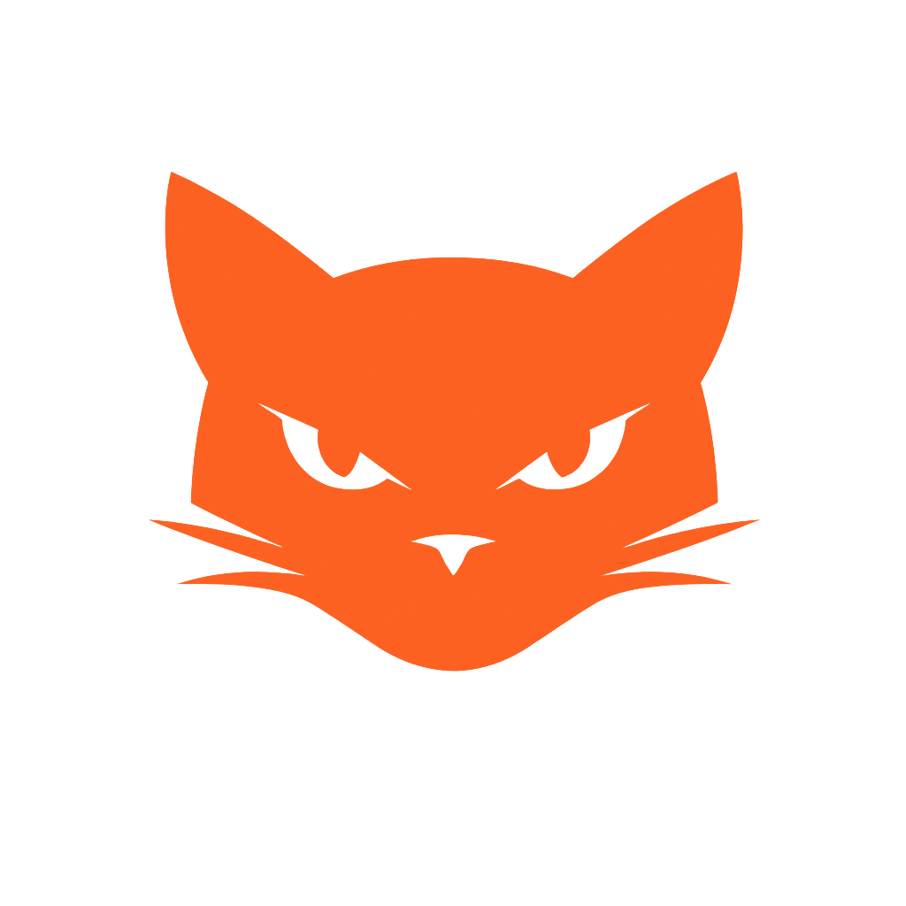

<div align="center">
  
  <h1>Video<font color="#FC6121">CAT</font></h1>
  <p><strong>Catálogo privado para videos en discos externos, con companion para Windows.</strong></p>

  <p>
    <a href="README.en.md">English</a>
  </p>

  <p>
    <a href="https://videocat.centeran.com"></a>
    <a href="https://github.com/reiterstahl/videocat/releases/latest"></a>
    <a href="https://github.com/reiterstahl/videocat/actions/workflows/ci.yml"></a>
    <a href="https://github.com/reiterstahl/videocat/releases/latest"></a>
    <a href="https://github.com/reiterstahl/videocat/blob/main/LICENSE"></a>
    <a href="https://github.com/sponsors/reiterstahl"></a>
  </p>

  <p>
    
    
    
    
    
  </p>
</div>

VideoCAT es un catálogo privado para videos guardados en discos duros externos. Está pensado para colecciones distribuidas en muchos discos que no siempre están conectados: indexa metadatos, rutas, miniaturas, etiquetas, duplicados y decisiones de revisión sin copiar los videos originales al servidor.

El sistema tiene dos partes:

- Una plataforma web con Docker Compose: `postgres`, `server` y `web`.
- Un companion para Windows que vive en la bandeja, detecta discos, escanea, abre archivos locales y procesa borrados pendientes.

> VideoCAT puede borrar archivos físicamente desde Windows cuando un video está marcado para borrar y el companion está en ejecución. Usa esta función solo si entiendes el flujo de revisión.

## Características

- Catálogo web privado con login de usuario y contraseña.
- Interfaz responsive con modo oscuro, menú fijo, búsqueda, filtros y paginación persistente.
- Soporte para reverse proxy, cookies seguras y despliegue bajo dominio propio.
- Identificación resiliente de discos mediante `.videocat-disk.json` en la raíz del disco.
- Escaneo aunque Windows cambie la letra de la unidad.
- Selección de discos conectados para trabajar solo con el subconjunto disponible.
- Filtros por disco, extensión, carpetas, etiquetas, categorías y duplicados.
- Árbol de carpetas colapsable con subcarpetas bajo demanda.
- Búsqueda tolerante a acentos y coincidencias parciales en nombre y ruta.
- Ordenamiento por columnas, tamaño de página configurable y conteo de resultados.
- Miniaturas y galería de fotogramas distribuidos del video.
- Modal de detalle con navegación por teclado, galería a pantalla completa y apertura local.
- Campo de última fecha de indexado por video.
- Cálculo del tamaño del folder que contiene cada video.
- Esquema de uso por folders para entender distribución de espacio.
- Detección de duplicados probables por tamaño, agrupados visualmente.
- Sección de duplicados para decidir acciones.
- Etiquetas automáticas basadas en nombres de archivo.
- Categorías personalizadas con colores, asignables de forma múltiple por video.
- Categorías incluidas para revisión: `Mantener`, `Marcado para borrar`, `Por revisar`, `SH` y otras definidas por el usuario.
- Review aleatorio de videos pendientes, filtrable por discos seleccionados/conectados.
- Precarga del siguiente video y sus miniaturas para hacer más fluido el flujo de review.
- Indicadores de review: pendientes, marcados hoy, racha semanal y GB liberados.
- Modal de espacio a recuperar que recomienda qué disco conectar para liberar más espacio.
- Sección `A descargar` para poner videos en cola y copiarlos desde discos conectados hacia una carpeta local.
- Selección aleatoria por tamaño objetivo en GB, limitada a discos conectados y opcionalmente a carpetas concretas.
- Progreso individual de copia por archivo, procesamiento de uno en uno, pausa, vaciado y procesamiento manual de cola.
- Etiquetas secundarias de descarga por año/mes para evitar repetir selecciones aleatorias ya descargadas.
- Borrado físico diferido de archivos marcados cuando el disco vuelve a conectarse.
- Sección de auditoría para errores de escaneo, metadatos, miniaturas y borrados.
- Sección administrativa para eliminar del catálogo el contenido de una unidad.
- Sección de perfil para configurar el PIN de seguridad y los patrones de folders protegidos.
- Protección por PIN para folders que coincidan con patrones configurables.
- Exclusión de carpetas protegidas del cálculo de duplicados.
- Omisión de carpetas de sistema como `$RECYCLE.BIN` y `System Volume Information`.
- Interfaz bilingüe español/inglés, con selector de idioma y enlaces opcionales de apoyo en la distribución oficial.

## URLs de las secciones

Cada sección tiene una URL propia, por lo que puedes recargar la página o compartir el enlace sin volver al catálogo:

| Sección | URL |
| --- | --- |
| Catálogo | `/catalogo` |
| Review | `/review` |
| A descargar | `/a-descargar` |
| Duplicados | `/duplicados` |
| Esquema de uso | `/esquema-de-uso` |
| Auditoría | `/auditoria` |
| Administración | `/administracion` |
| Perfil | `/perfil` |

También se aceptan las rutas equivalentes en inglés para facilitar enlaces compartidos. La ruta raíz redirige automáticamente a `/catalogo`.

## Companion de Windows

El companion convierte el agente en una app de bandeja. Permite usar VideoCAT sin abrir una terminal.

Funciones principales:

- Se ejecuta en segundo plano desde la bandeja de Windows.
- Inicia y mantiene activo el companion local.
- Configura `SERVER_URL`, `WEB_URL`, `AGENT_TOKEN` y opciones locales desde una ventana.
- Muestra una ventana de actividad con logs en vivo.
- Detecta discos montados que tengan `.videocat-disk.json`.
- Permite añadir unidades o carpetas locales/de red como rutas monitoreadas desde la configuración del companion.
- Permite dejar de monitorear rutas manuales y ocultar discos VideoCAT detectados sin borrar su marcador.
- Revisa periódicamente si se conectaron nuevos discos.
- Reescanea periódicamente las rutas monitoreadas para detectar contenido nuevo.
- Reconstruye desde el servidor el estado ligero de cada disco, evitando repetir metadatos y miniaturas de archivos sin cambios aunque se haya perdido el estado local del companion.
- Concilia archivos ausentes tras pasadas completas: los oculta sin perder etiquetas, metadatos ni historial y los reactiva si reaparecen.
- Escanea discos o rutas bajo solicitud.
- Procesa borrados pendientes automáticamente.
- Conserva un historial de borrados y fallos con fecha, disco, ruta y tamaño; la web también puede solicitar su procesamiento inmediato en los discos conectados.
- Procesa la cola `A descargar`, copiando archivos hacia la carpeta local configurada.
- Abre videos con el reproductor por defecto.
- Abre la carpeta local del archivo.
- Reporta estado a la web para mostrar si el companion está sincronizado.
- Genera una identidad UUID persistente por instalación y la reporta al servidor para distinguir companions durante la transición de seguridad.
- Ejecuta borrados solo cuando el disco correcto está conectado y la ruta es segura.
- Valida la ruta canónica antes de abrir, copiar o borrar para impedir escapes mediante enlaces o junctions.
- Evita sobrescribir por accidente un archivo existente en la carpeta de descarga.

## Release actual

La versión actual es `v0.1.10`.

- Código fuente: <https://github.com/reiterstahl/videocat>
- Sitio del proyecto: <https://videocat.centeran.com>
- Release: <https://github.com/reiterstahl/videocat/releases/latest>
- Companion Windows: `VideoCAT-Companion-0.1.10.exe`

Verificación recomendada del companion:

```text
Los hashes SHA-256 y MD5 del ejecutable están publicados como assets del release correspondiente.
```

En Windows:

```powershell
Get-FileHash .\VideoCAT-Companion-0.1.10.exe -Algorithm SHA256
```

## Stack

- Monorepo TypeScript con npm workspaces.
- Backend Fastify + Prisma + PostgreSQL.
- Web React + Vite + Nginx.
- Agente/companion Windows con Node.js, Electron, `ffprobe` y `ffmpeg`.
- Docker Compose para servidor, web y base de datos.

## Instalación rápida con Docker Compose

Requisitos:

- Docker y Docker Compose.
- Node.js solo si vas a desarrollar o construir el companion Windows.
- `ffmpeg` y `ffprobe` en Windows para el escaneo.

1. Copia el ejemplo de variables:

```bash
cp .env.example .env
```

2. Edita `.env` y cambia como mínimo:

```env
POSTGRES_PASSWORD=replace-with-64-hex-random-characters
JWT_SECRET=replace-with-64-hex-random-characters
AGENT_TOKEN=replace-with-64-hex-random-characters
PROTECTED_FOLDER_PIN=replace-with-4-digit-pin
PROTECTED_FOLDER_PATTERNS=Private,Protected
ADMIN_USER=admin
ADMIN_PASSWORD=replace-with-a-long-unique-password
```

Puedes generar secretos con:

```bash
openssl rand -hex 32
```

3. Levanta la plataforma:

```bash
docker compose up -d --build
```

4. Abre la web:

```text
http://localhost:8081
```

Servicios por defecto:

- Web: `http://localhost:8081`
- API publicada localmente: `http://127.0.0.1:4001`
- PostgreSQL: red interna de Docker
- Miniaturas: volumen persistente `thumbnails_data`

## Reverse proxy

La forma recomendada es publicar el contenedor `web` hacia el reverse proxy. Ese contenedor sirve React y proxy interno para:

- `/api/*` hacia `server:4000`
- `/thumbnails/*` hacia `server:4000`

Variables recomendadas:

```env
WEB_ORIGIN=https://cat.example.com
WEB_BIND_ADDR=0.0.0.0
WEB_PUBLISHED_PORT=8081
SERVER_BIND_ADDR=127.0.0.1
SERVER_PUBLISHED_PORT=4001
TRUST_PROXY=true
COOKIE_SECURE=true
PUBLIC_THUMBNAILS_BASE_URL=/thumbnails
```

Ejemplo Nginx externo:

```nginx
server {
  server_name cat.example.com;

  client_max_body_size 25m;

  location / {
    proxy_pass http://127.0.0.1:8081;
    proxy_http_version 1.1;
    proxy_set_header Host $host;
    proxy_set_header X-Real-IP $remote_addr;
    proxy_set_header X-Forwarded-For $proxy_add_x_forwarded_for;
    proxy_set_header X-Forwarded-Host $host;
    proxy_set_header X-Forwarded-Proto $scheme;
  }
}
```

Para pruebas locales sin HTTPS puedes usar `COOKIE_SECURE=false`. En producción con HTTPS déjalo en `true`.

## Agente CLI de Windows

Requisitos:

- Node.js 22 o superior; Node.js 24 LTS es la versión recomendada.
- `ffmpeg` y `ffprobe` disponibles en `PATH`.
- Disco externo montado y desbloqueado si usa BitLocker.

Instalación:

```powershell
cd $env:USERPROFILE\videocat
npm install
```

Configura variables en `apps\agent-windows\.env`:

```env
SERVER_URL=https://cat.example.com
WEB_URL=https://cat.example.com
AGENT_TOKEN=replace-with-agent-token
AGENT_CONCURRENCY=2
AGENT_STATE_DIR=
FFMPEG_PATH=
FFPROBE_PATH=
COMPANION_PORT=29429
COMPANION_NAME=
COMPANION_ALLOWED_ORIGINS=https://cat.example.com,http://localhost:5173,http://127.0.0.1:5173
COMPANION_DISK_POLL_MS=5000
COMPANION_SCAN_POLL_MS=900000
COMPANION_DELETE_POLL_MS=60000
TRAY_DISK_POLL_MS=10000
COMPANION_AUTO_DELETE_MARKED=true
# Normalmente se editan desde la ventana de configuracion del companion.
COMPANION_MONITORED_TARGETS=[]
COMPANION_DISABLED_DISK_IDS=
# Opcional: si se define, la web debe enviar el mismo token local.
# COMPANION_TOKEN=replace-with-local-token
```

Modo asistido:

```powershell
npm run wizard -w @videocat/agent-windows
```

Escaneo directo:

```powershell
npm run scan -w @videocat/agent-windows -- --path "E:" --disk-name "WD 6TB Video 01"
```

Inicializar un disco con identificador estable:

```powershell
npm run init-disk -w @videocat/agent-windows -- --path "E:" --disk-name "WD 6TB Video 01" --scan-root "Videos"
```

Esto crea:

```text
E:\.videocat-disk.json
```

Ese archivo contiene el `diskId`, nombre amigable y rutas internas de escaneo. Si Windows cambia la letra del disco, VideoCAT puede reconocerlo igualmente.

Agregar otra ruta de escaneo:

```powershell
npm run add-root -w @videocat/agent-windows -- --path "E:" --scan-root "Archivo/Clientes"
```

Descubrir discos marcados:

```powershell
npm run discover -w @videocat/agent-windows
```

## Companion portable para Windows

Construir el ejecutable, validar TypeScript y generar sus hashes automáticamente:

```powershell
powershell -ExecutionPolicy Bypass -File .\package-companion.ps1
```

El script instala exactamente las dependencias del `package-lock.json`, compila el runtime y la bandeja, genera SHA-256 y MD5, y deja los tres archivos listos tanto en `apps\agent-windows\release` como en `companion`.

Para incrementar primero la versión patch y abrir la carpeta resultante:

```powershell
powershell -ExecutionPolicy Bypass -File .\package-companion.ps1 -Bump patch -OpenOutput
```

Para subir los assets a un release `vX.Y.Z` que ya exista en GitHub mediante `gh`:

```powershell
powershell -ExecutionPolicy Bypass -File .\package-companion.ps1 -PublishRelease
```

Construcción manual alternativa:

```powershell
npm install
npm run package:tray -w @videocat/agent-windows
```

El ejecutable queda en:

```text
apps\agent-windows\release\VideoCAT-Companion-0.1.10.exe
```

Uso:

1. Abre el ejecutable.
2. Clic derecho en el ícono de la bandeja.
3. Entra a `Configuración...`.
4. Guarda `SERVER_URL`, `WEB_URL` y `AGENT_TOKEN`.
5. Usa `Ver actividad...` para revisar logs.
6. Conecta discos marcados con `.videocat-disk.json`.

## Flujo de review y borrado

1. En la web, entra a `Review`.
2. Usa `Iniciar Review` para recibir un video aleatorio pendiente.
3. Puedes asignar categorías adicionales mientras revisas.
4. `Mantener` marca el video como conservado.
5. `Borrar` marca el video como `Marcado para borrar`.
6. El archivo no se borra inmediatamente desde el servidor.
7. Cuando el disco correcto se conecta y el companion está activo, el companion procesa los borrados pendientes.
8. El contador de GB liberados aumenta conforme los archivos se eliminan físicamente.

Si usas `Mostrar conectados`, Review selecciona videos aleatorios solo de los discos seleccionados/conectados.

## Seguridad y privacidad

- La web requiere login.
- Las rutas del agente están protegidas por `AGENT_TOKEN`.
- Cada instalación del Companion mantiene además una identidad UUID persistente en su directorio de estado; esta entrega la registra y permite revocarla sin rotar todavía el token compartido.
- El companion local puede protegerse con `COMPANION_TOKEN`.
- Las sesiones JWT restringen explícitamente el algoritmo de firma y caducan a las 12 horas.
- Las operaciones web que modifican datos validan su origen contra `WEB_ORIGIN`.
- La API utiliza límites de cuerpo y tiempo, rate limiting acotado y respuestas sensibles sin caché.
- Nginx y Fastify envían CSP, HSTS bajo HTTPS y otras cabeceras de endurecimiento.
- Las miniaturas se validan como JPEG antes de guardarse.
- Las rutas locales se resuelven de forma canónica antes de abrir, copiar o borrar archivos.
- Cookies seguras y `TRUST_PROXY` están soportados para despliegues con HTTPS.
- Folders cuyo nombre coincida con `PROTECTED_FOLDER_PATTERNS` requieren PIN en la sesión web.
- El servidor no necesita acceso directo a tus discos externos.
- Los videos originales no se suben al servidor.
- Se suben metadatos, rutas relativas, miniaturas y errores de auditoría.
- El borrado físico ocurre solo en Windows, por el companion, cuando el disco está conectado.
- CI ejecuta instalación limpia, auditoría de dependencias, pruebas unitarias/API con PostgreSQL temporal, typecheck y build en cada cambio a `main` y en cada pull request.
- Dependabot revisa semanalmente dependencias npm, imágenes base y GitHub Actions.

`PROTECTED_FOLDER_PATTERNS` es una lista separada por comas. Para una instalación pública o genérica puedes usar valores como `Private,Protected`. Para una instalación privada, define ahí los fragmentos reales de nombre de carpeta que quieres proteger sin modificar el código.

Consulta [SECURITY.md](SECURITY.md) para reportar vulnerabilidades de forma privada y [ROADMAP.es.md](ROADMAP.es.md) para conocer el plan de endurecimiento y fiabilidad pendiente.

## Backups

Respalda:

- Base PostgreSQL.
- Volumen `thumbnails_data`.
- Archivo `.env`.
- Opcionalmente el `.env` local del companion.

Ejemplo:

```bash
docker compose exec postgres pg_dump -U videocat videocat > videocat.sql
```

## Actualizar

Servidor:

```bash
git pull
npm install
docker compose up -d --build server web
```

Si hay cambios de base de datos, el contenedor `server` ejecuta `prisma migrate deploy` al iniciar.

Companion Windows:

```powershell
git pull
npm install
npm run package:tray -w @videocat/agent-windows
```

## Desarrollo local

```bash
npm install
npm run prisma:generate
npm run dev:server
npm run dev:web
```

Para ejecutar la red de seguridad local:

```bash
npm test
```

Las pruebas de API que escriben en PostgreSQL se activan con `RUN_DB_TESTS=true` y requieren una base disponible; CI las ejecuta automáticamente. Los helpers sensibles seleccionados tienen umbrales mínimos de cobertura que también bloquean regresiones.

La web de Vite corre en:

```text
http://localhost:5173
```

## Imágenes Docker Hub

La forma más rápida de probar VideoCAT con imágenes preconstruidas es:

Linux/macOS/WSL:

```bash
curl -fsSL https://raw.githubusercontent.com/reiterstahl/videocat/main/install.sh | sh
```

Windows PowerShell con Docker Desktop:

```powershell
powershell -ExecutionPolicy Bypass -Command "irm https://raw.githubusercontent.com/reiterstahl/videocat/main/install.ps1 | iex"
```

El instalador crea una carpeta `videocat`, descarga `docker-compose.hub.yml`, genera secretos en `.env`, descarga las imágenes y levanta el stack.

Luego abre:

```text
http://localhost:8081
```

Imágenes oficiales:

```text
reiterstahl/videocat-server:0.1.10
reiterstahl/videocat-web:0.1.10
```

También se publican etiquetas `latest`:

```text
reiterstahl/videocat-server:latest
reiterstahl/videocat-web:latest
```

Instalación manual:

Linux/macOS/WSL:

```bash
mkdir videocat
cd videocat
curl -fsSLO https://raw.githubusercontent.com/reiterstahl/videocat/main/docker-compose.hub.yml
curl -fsSLO https://raw.githubusercontent.com/reiterstahl/videocat/main/.env.example
mv .env.example .env
```

Windows PowerShell:

```powershell
New-Item -ItemType Directory -Force -Path videocat
Set-Location videocat
Invoke-WebRequest https://raw.githubusercontent.com/reiterstahl/videocat/main/docker-compose.hub.yml -OutFile docker-compose.hub.yml
Invoke-WebRequest https://raw.githubusercontent.com/reiterstahl/videocat/main/.env.example -OutFile .env
```

Edita `.env`, cambia los secretos y para pruebas locales sin HTTPS usa:

```env
WEB_ORIGIN=http://localhost:8081
COOKIE_SECURE=false
```

Levanta el stack:

```bash
docker compose -f docker-compose.hub.yml up -d
```

Para publicar nuevas imágenes oficiales:

```bash
docker buildx build --platform linux/amd64,linux/arm64 -f apps/server/Dockerfile -t reiterstahl/videocat-server:0.1.10 -t reiterstahl/videocat-server:latest --push .
docker buildx build --platform linux/amd64,linux/arm64 -f apps/web/Dockerfile --build-arg VITE_VIDEOCAT_VERSION=0.1.10 -t reiterstahl/videocat-web:0.1.10 -t reiterstahl/videocat-web:latest --push .
```

El `docker-compose.yml` principal sigue construyendo localmente con `build`, útil para desarrollo:

```bash
docker compose up -d --build
```

El compose de Docker Hub usa:

```yaml
server:
  image: reiterstahl/videocat-server:0.1.10

web:
  image: reiterstahl/videocat-web:0.1.10
```

## Endpoints principales

Agente:

- `POST /api/agent/register-disk`
- `POST /api/agent/scan/start`
- `POST /api/agent/files/batch`
- `POST /api/agent/thumbnails/upload`
- `POST /api/agent/scan/finish`
- `POST /api/agent/errors/batch`

Web:

- `POST /api/auth/login`
- `POST /api/auth/logout`
- `GET /api/files`
- `GET /api/files/:id`
- `GET /api/disks`
- `GET /api/facets`
- `GET /api/duplicates/by-size`
- `GET /api/folder-usage`
- `GET /api/audit/errors`
- `GET /api/review/summary`
- `GET /api/review/next`
- `GET /api/review/recoverable-space`
- `GET /api/profile/security`
- `PATCH /api/profile/security`

## Licencia y apoyo

VideoCAT se distribuye bajo licencia `AGPL-3.0-or-later`. Esta licencia permite usar, estudiar, modificar, distribuir y publicar versiones derivadas del proyecto, manteniendo las obligaciones de copyleft y atribución indicadas por la licencia.

La distribución oficial incluye enlaces opcionales de apoyo para el autor original. Forks y versiones modificadas pueden quitar o reemplazar esos enlaces, siempre que cumplan la licencia del proyecto y conserven los avisos obligatorios de copyright y atribución.
