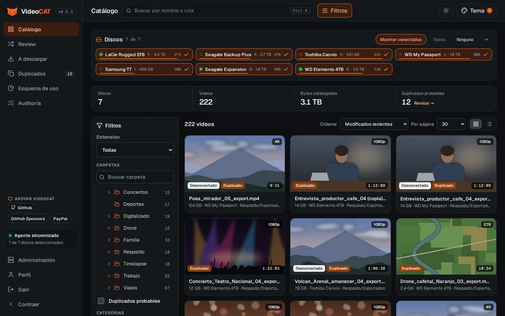
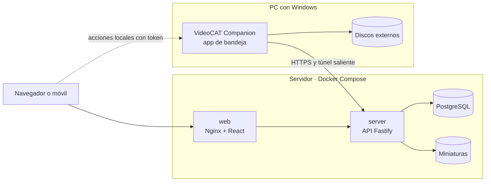
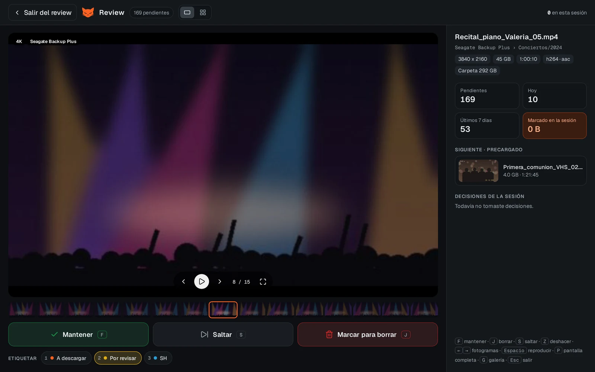
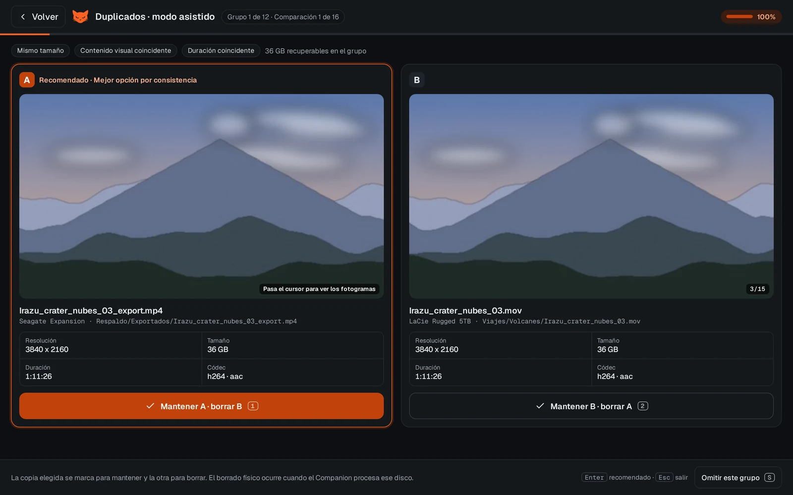
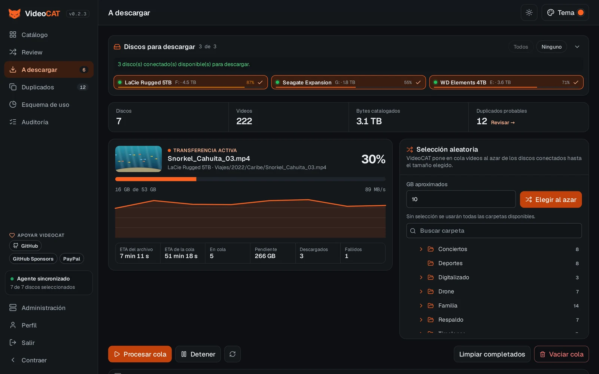
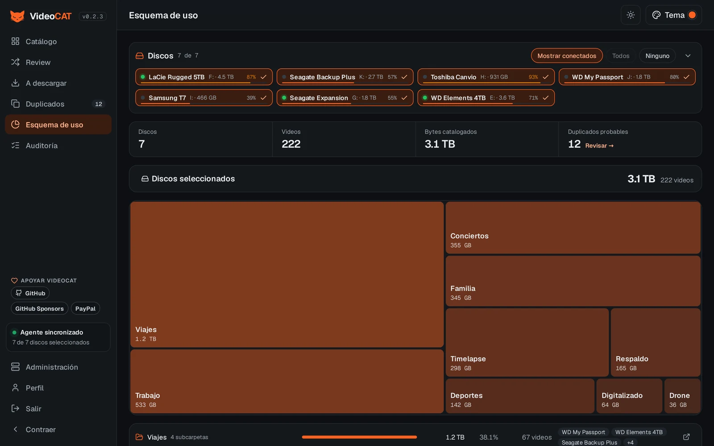
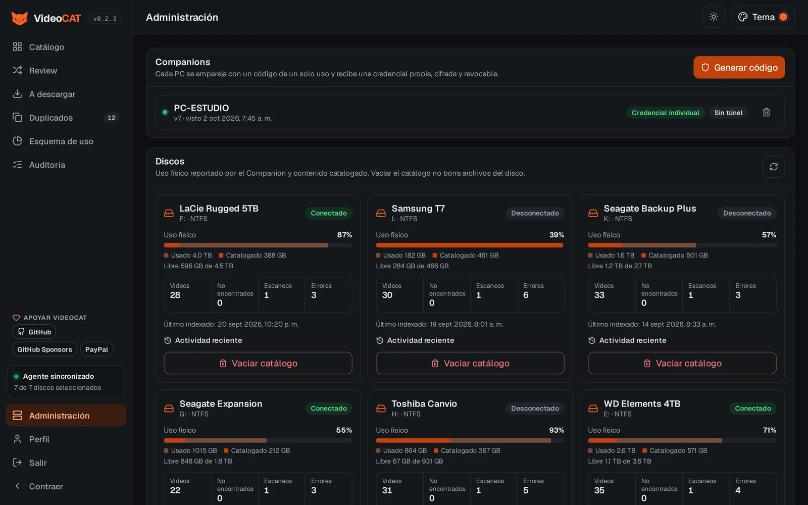
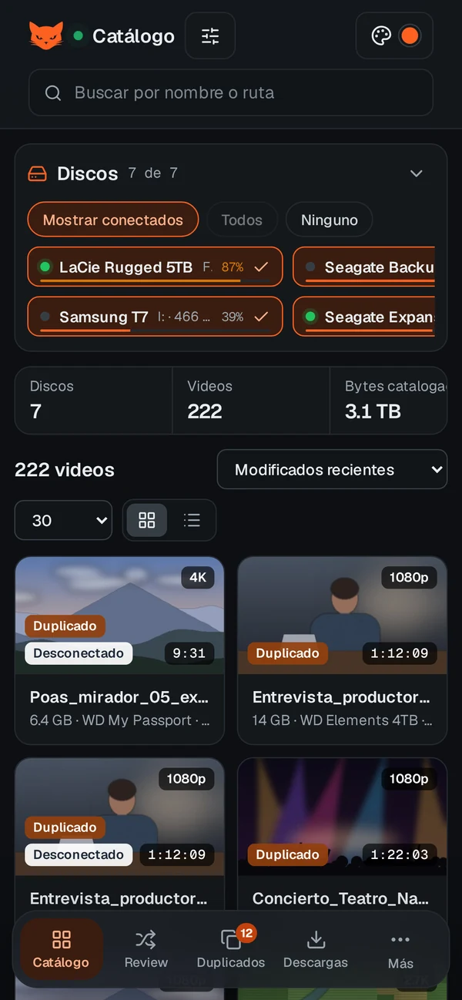
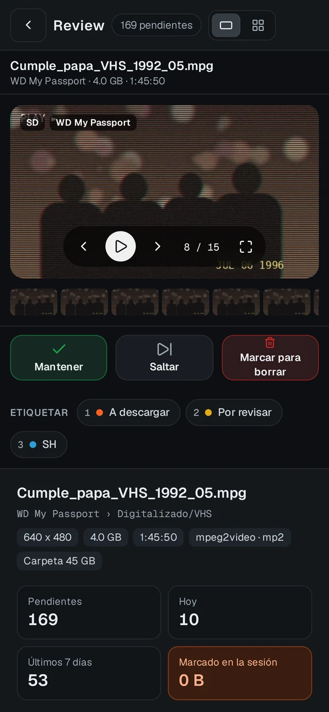
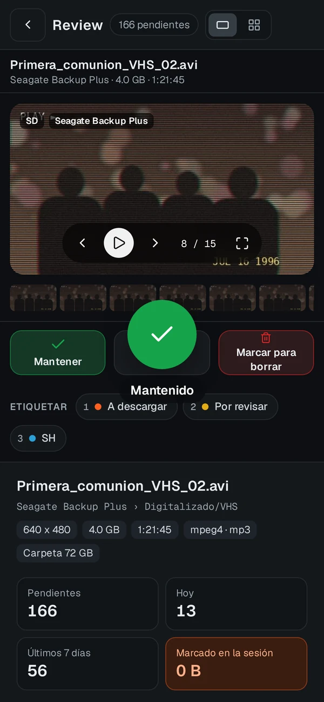

<div align="center">
  
  <h1>Video<font color="#FC6121">CAT</font></h1>
  <p><strong>Catálogo privado para videos repartidos en discos externos, con un Companion para Windows.</strong></p>

  <p>
    <strong>Español</strong> · <a href="README.en.md">English</a>
  </p>

  <p>
    <a href="https://videocat.centeran.com"></a>
    <a href="https://github.com/reiterstahl/videocat/releases/latest"></a>
    <a href="https://hub.docker.com/r/reiterstahl/videocat-web"></a>
    <a href="https://github.com/reiterstahl/videocat/actions/workflows/ci.yml"></a>
    <a href="https://github.com/reiterstahl/videocat/releases/latest/download/VideoCAT-Companion-win-Setup.exe"></a>
    <a href="https://github.com/reiterstahl/videocat/blob/main/LICENSE"></a>
    <a href="https://github.com/sponsors/reiterstahl"></a>
  </p>
</div>

VideoCAT indexa los videos de tus discos externos —aunque casi nunca estén conectados— y te deja buscarlos, revisarlos, encontrar duplicados, reproducirlos a distancia y liberar espacio desde el navegador o el móvil. **Los videos nunca salen de tus discos:** el servidor guarda solo metadatos, rutas relativas y miniaturas.

<p align="center">
  
</p>

> [!WARNING]
> VideoCAT puede **borrar archivos físicamente** en Windows: cuando marcas un video para borrar, el Companion lo elimina al conectarse el disco correcto. Antes de usarlo con material importante, lee [Review y borrado seguro](#review-y-borrado-seguro).

## Contenido

- [Cómo funciona](#cómo-funciona)
- [Características](#características)
- [Inicio rápido](#inicio-rápido)
- [Uso diario](#uso-diario)
- [Despliegue en producción](#despliegue-en-producción)
- [Seguridad y privacidad](#seguridad-y-privacidad)
- [Configuración del Companion](#configuración-del-companion)
- [Desarrollo](#desarrollo)
- [Publicar versiones](#publicar-versiones)
- [Documentación relacionada](#documentación-relacionada)
- [Licencia y apoyo](#licencia-y-apoyo)

## Cómo funciona


```mermaid
flowchart LR
  browser["Navegador o móvil"] --> web
  subgraph server_host["Servidor · Docker Compose"]
    web["web<br/>Nginx + React"] --> api["server<br/>API Fastify"]
    api --> db[("PostgreSQL")]
    api --> thumbs[("Miniaturas")]
  end
  subgraph windows["PC con Windows"]
    companion["VideoCAT Companion<br/>app de bandeja"] --> disks[("Discos externos")]
  end
  companion -- "HTTPS y túnel saliente" --> api
  browser -. "acciones locales con token" .-> companion
```

| Pieza | Qué hace |
| --- | --- |
| **web** | Sirve la interfaz React y hace de proxy hacia la API y las miniaturas. Es lo único que publicas en tu reverse proxy. |
| **server** | API con login, catálogo, review, duplicados, auditoría y el túnel con los Companions. Aplica las migraciones al arrancar. |
| **postgres** | Base de datos del catálogo. Solo es accesible en la red interna de Docker. |
| **Companion** | App de bandeja en Windows: detecta discos, escanea con FFmpeg, sube metadatos y miniaturas, procesa borrados y copias, y sirve reproducción remota por un túnel **saliente** (no abre puertos). |

## Características

### Catálogo
- Cuadrícula o lista, búsqueda con `Ctrl K` tolerante a acentos, chips de filtros activos y panel de detalle.
- Filtros por disco, extensión, carpeta (árbol con carga bajo demanda), etiquetas, categorías y duplicados.
- Tira de discos con capacidad y uso, y **Mostrar conectados** para trabajar solo con lo que está enchufado.
- Discos identificados por `.videocat-disk.json`: se reconocen aunque Windows cambie la letra de la unidad.
- Miniaturas, galería de 15 fotogramas por video, tamaño de la carpeta y fecha del último indexado.

### Review
- Sesión inmersiva a pantalla completa con videos pendientes al azar, filtrable por discos conectados.
- Atajos de mano izquierda y derecha: **F** mantener, **J** marcar para borrar, más saltar, deshacer y etiquetas numeradas.
- Vista de fotograma o **galería** con todas las miniaturas a la vez.
- Confirmación animada de cada decisión y **modo privacidad** con la barra espaciadora (pantalla en negro). En el móvil, además, el nombre del archivo queda fijo arriba y la vista vuelve sola al inicio.
- Precarga del siguiente video, indicadores de pendientes, racha semanal y espacio marcado para liberar.

### Duplicados
- Detección por tamaño y por **huellas visuales perceptuales** en 15 puntos, que reconocen copias con distinta resolución, códec o compresión.
- Nivel de confianza, motivos y espacio recuperable por grupo.
- Modo asistido con comparación lado a lado, recomendación por resolución, tamaño y duración, y decisiones de un clic o una tecla.
- Priorización de discos por espacio duplicado recuperable.

### Reproducción remota
- Ve cualquier video desde el móvil u otro navegador a través del túnel saliente del Companion, sin compartir rutas de Windows ni montar discos en el servidor.
- Reproductor táctil: doble toque para avanzar o retroceder, siguiente video y modo aleatorio entre discos conectados.
- Remux temporal opcional a MP4 para H.264/AAC en contenedores incompatibles. Chromecast opcional con enlaces firmados y temporales.

### A descargar
- Cola para copiar videos desde discos conectados a una carpeta local de Windows, con progreso por archivo, pausa y vaciado.
- Selección aleatoria por tamaño objetivo en GB, limitada a discos o carpetas, sin repetir lo ya descargado.

### Organización, administración y auditoría
- Categorías propias con colores, asignables varias por video, y etiquetas automáticas a partir de los nombres.
- **Esquema de uso** como mapa de carpetas por tamaño, navegable por niveles.
- Administración con espacio físico y catalogado por disco, Companions emparejados, actividad reciente y limpieza.
- Auditoría de errores agrupados y acciones, con búsqueda, filtros y exportación CSV.
- Carpetas protegidas por PIN según patrones de nombre, excluidas del cálculo de duplicados.

### Interfaz
- **App instalable (PWA)** en Windows, macOS, Android, iPhone y iPad: se abre desde su propio ícono en una ventana sin pestañas, se actualiza sola con cada versión del servidor y avisa cuando no hay conexión. No guarda datos del catálogo en el dispositivo.
- Español e inglés, temas claro, oscuro, OLED o del sistema, seis colores de acento y densidad cómoda o compacta.
- Responsive: barra lateral contraíble en escritorio, barra de pestañas y hojas desplegables en el móvil.
- Cada sección tiene su URL (`/catalogo`, `/review`, `/duplicados`…), que también se puede abrir con su equivalente en inglés.

### Companion de Windows
- Se instala con un Setup.exe, sin permisos de administrador, y **se actualiza solo** desde GitHub Releases.
- Emparejamiento con un código de un solo uso y credencial individual cifrada por Windows.
- Monitorea discos con marcador y rutas añadidas a mano, y reescanea periódicamente sin repetir trabajo.
- Concilia archivos ausentes sin perder etiquetas ni historial, y los reactiva si reaparecen.
- Antes de borrar, revalida tamaño, fecha y huella visual; si la ruta ya contiene otro archivo, cancela.

<details>
<summary><strong>Más capturas</strong></summary>

| Review | Duplicados en modo asistido |
| --- | --- |
|  |  |

| A descargar | Esquema de uso |
| --- | --- |
|  |  |

| Administración | Companion de Windows |
| --- | --- |
|  |  |

<p align="center">
  
  
  
</p>

Todas las capturas usan datos ficticios.
</details>

## Inicio rápido

### 1. Servidor con Docker

Necesitas Docker con Compose. El instalador crea una carpeta `videocat`, descarga `docker-compose.hub.yml`, genera secretos en `.env` y levanta el stack con las imágenes oficiales.

Linux, macOS o WSL:

```bash
curl -fsSL https://raw.githubusercontent.com/reiterstahl/videocat/main/install.sh | sh
```

Windows PowerShell con Docker Desktop:

```powershell
powershell -ExecutionPolicy Bypass -Command "irm https://raw.githubusercontent.com/reiterstahl/videocat/main/install.ps1 | iex"
```

Abre `http://localhost:8081` e inicia sesión como `admin` con la contraseña que muestra el instalador (también queda en `videocat/.env`).

<details>
<summary>Instalación manual con las imágenes de Docker Hub</summary>

```bash
mkdir videocat && cd videocat
curl -fsSLO https://raw.githubusercontent.com/reiterstahl/videocat/main/docker-compose.hub.yml
curl -fsSL https://raw.githubusercontent.com/reiterstahl/videocat/main/.env.example -o .env
```

Edita `.env` y reemplaza todos los valores `replace-with-…`. Genera cada secreto con `openssl rand -hex 32`. Para probar en local sin HTTPS usa `WEB_ORIGIN=http://localhost:8081` y `COOKIE_SECURE=false`. Luego:

```bash
docker compose -f docker-compose.hub.yml up -d
```

Imágenes oficiales (amd64 y arm64): `reiterstahl/videocat-server` y `reiterstahl/videocat-web`, con etiqueta de versión (`0.2.8`) y `latest`.
</details>

### 2. Companion en Windows

1. Instala FFmpeg, que el Companion usa para leer metadatos y generar miniaturas. Lo encuentra solo si lo instalas con WinGet, Scoop o Chocolatey, o en `C:\ffmpeg\bin`:

   ```powershell
   winget install Gyan.FFmpeg
   ```

2. Descarga e instala [**VideoCAT-Companion-win-Setup.exe**](https://github.com/reiterstahl/videocat/releases/latest/download/VideoCAT-Companion-win-Setup.exe) y ábrelo desde el menú Inicio. Queda en la bandeja del sistema.
3. En la web, entra a **Administración › Companions** y genera un código de emparejamiento.
4. En el Companion, abre **Configuración… › Conexión**, escribe la URL del servidor, pega el código y pulsa **Emparejar**.
5. En **Configuración… › Navegador**, copia el token local y pégalo en la web en **Perfil › Companion local**. Así ese navegador puede abrir, copiar y borrar archivos en esta PC.

> [!TIP]
> Si usabas el `.exe` portable (0.2.2 o anterior), ciérralo, instala con Setup.exe y borra el portable: la configuración y el emparejamiento se conservan en `%APPDATA%\VideoCAT Companion`.

### 3. Tus discos

Desde **Configuración… › Rutas** del Companion puedes:

- **Añadir unidad…** o **Añadir carpeta…** (local o de red) para monitorearla y escanearla automáticamente.
- Ver los **discos VideoCAT detectados**: los que tienen un archivo `.videocat-disk.json` en la raíz. Ese marcador les da una identidad estable aunque cambie la letra de la unidad, y te deja elegir qué carpetas internas escanear.

Para crear el marcador, usa el [agente CLI](#agente-cli) (`init-disk` o `wizard`) o crea el archivo a mano en la raíz del disco:

```json
{
  "schemaVersion": 1,
  "diskId": "genera-un-uuid-v4",
  "diskName": "WD 6TB Video 01",
  "createdAt": "2026-10-02T00:00:00.000Z",
  "scanRoots": ["."]
}
```

El primer escaneo sube metadatos y miniaturas. Los siguientes solo procesan lo nuevo o modificado.

### 4. Instalar como app (opcional)

VideoCAT se puede instalar como app desde el navegador. En **Perfil › App de VideoCAT** verás el botón o las instrucciones para tu navegador:

- **Chrome y Edge** (Windows, macOS, Linux, Android): botón **Instalar app** en la barra lateral, o el ícono de instalar en la barra de direcciones.
- **Firefox 143 o posterior en Windows**: ícono **Añadir a la barra de tareas** a la derecha de la barra de direcciones. En Android: menú › **Instalar**.
- **iPhone y iPad**: **Compartir › Agregar a pantalla de inicio**.
- **Safari en macOS**: **Archivo › Añadir al Dock**.

> [!NOTE]
> Los navegadores solo instalan apps desde **HTTPS** (o `localhost`). Si abres VideoCAT por `http://` con una IP de tu red, primero publícalo con HTTPS detrás de tu reverse proxy.

La app guarda en el dispositivo solo su propio código (interfaz, estilos e íconos) para abrir rápido. Las respuestas de la API, las miniaturas y los videos siempre se piden al servidor, así que no queda información del catálogo en el equipo. Cuando publicas una versión nueva del stack, la app muestra **Hay una nueva versión de VideoCAT · Actualizar**.

## Uso diario

### Review y borrado seguro

1. Entra a **Review** y pulsa **Iniciar Review**. Con **Mostrar conectados**, solo aparecen videos de los discos enchufados.
2. Decide con los botones o con el teclado. Puedes asignar categorías mientras revisas.
3. **Marcar para borrar** no borra nada en el servidor: el video queda en la categoría *Marcado para borrar*.
4. Cuando el disco correcto está conectado y el Companion activo, este borra los archivos pendientes. Antes revalida tamaño, fecha de modificación y huella visual, y resuelve la ruta canónica para no seguir enlaces ni junctions.
5. El historial guarda fecha, disco, ruta y tamaño de cada borrado o fallo, y el contador de espacio liberado se actualiza.

Si prefieres que el Companion no borre solo, cambia **Borrar los marcados** a *Solo a pedido* en **Configuración… › Avanzado**.

| Tecla | Acción en Review |
| --- | --- |
| `F` | Mantener |
| `J` | Marcar para borrar |
| `S` | Saltar |
| `Z` | Deshacer la última decisión |
| `1`–`9` | Activar o quitar una etiqueta |
| `←` `→` | Fotograma anterior o siguiente |
| `Enter` | Reproducir los fotogramas |
| `Espacio` | Modo privacidad: pantalla en negro hasta otro `Espacio`, `Esc` o un clic, sin tomar decisiones |
| `G` | Alternar fotograma y galería |
| `P` | Pantalla completa |
| `Esc` | Salir |

En **Duplicados › Iniciar modo asistido**: `1` o `←` mantiene la copia A y marca la B para borrar, `2` o `→` hace lo contrario, `Enter` aplica la recomendación, `S` salta el grupo y `Esc` sale.

### Reproducción remota y Chromecast

El reproductor comprueba primero si el navegador soporta el contenedor y los codecs. Para videos H.264 con audio AAC o MP3 dentro de un contenedor incompatible, puedes habilitar un **remux temporal a MP4**, que copia los streams sin recodificar:

1. En el servidor, define `REMOTE_REMUX_ENABLED=true` y reinicia `server`.
2. En el Companion, activa **Remux MP4 temporal** en **Configuración… › Avanzado**.

VideoCAT no transcodifica H.265, AV1 ni otros codecs, porque consumiría mucha CPU. Cada sesión pertenece al usuario que la creó, tiene límites de duración, inactividad y concurrencia, y se cierra al detener el reproductor o perder el túnel.

Chromecast está desactivado por defecto: actívalo en **Perfil**. El SDK de Google Cast solo se carga al usar el botón, y el receptor recibe una URL firmada y temporal, nunca tus credenciales. El Chromecast debe poder alcanzar el dominio o la IP de VideoCAT.

## Despliegue en producción

### Variables del servidor

Las principales de `.env` (la lista completa, con comentarios, está en [`.env.example`](.env.example)):

| Variable | Para qué sirve |
| --- | --- |
| `POSTGRES_PASSWORD`, `JWT_SECRET`, `AGENT_TOKEN` | Secretos. Genera cada uno con `openssl rand -hex 32`. |
| `ADMIN_USER`, `ADMIN_PASSWORD` | Usuario de la web. |
| `WEB_ORIGIN` | URL pública exacta (por ejemplo `https://cat.example.com`). Las escrituras desde otro origen se rechazan. |
| `COOKIE_SECURE` | `true` con HTTPS; `false` solo para pruebas locales. |
| `TRUST_PROXY`, `TRUST_PROXY_CIDRS` | Confianza en el reverse proxy; mejor limitarla a sus CIDR. |
| `WEB_BIND_ADDR`, `WEB_PUBLISHED_PORT` | Dónde publica el contenedor `web` (por defecto `0.0.0.0:8081`). |
| `PROTECTED_FOLDER_PIN`, `PROTECTED_FOLDER_PATTERNS` | PIN y fragmentos de nombre de carpeta protegidos (por ejemplo `Private,Protected`). |
| `VIDEOCAT_VERSION` | Versión de las imágenes en `docker-compose.hub.yml` (`0.2.8` o `latest`). |
| `REMOTE_REMUX_ENABLED`, `REMOTE_STREAM_*` | Remux opcional y límites de la reproducción remota. |
| `*_RETENTION_DAYS` | Retención de errores, acciones y escaneos al ejecutar la limpieza desde Administración. |

### Reverse proxy

Publica solo el contenedor `web`: ya hace de proxy de `/api/*` y `/thumbnails/*` hacia `server:4000`, y reenvía el WebSocket del túnel. Tu proxy externo también debe permitir `Upgrade` en `/api/agent/tunnel`. Ejemplo con Nginx:

```nginx
map $http_upgrade $connection_upgrade {
  default upgrade;
  ''      close;
}

server {
  server_name cat.example.com;
  client_max_body_size 25m;

  location / {
    proxy_pass http://127.0.0.1:8081;
    proxy_http_version 1.1;
    proxy_set_header Host $host;
    proxy_set_header X-Real-IP $remote_addr;
    proxy_set_header X-Forwarded-For $proxy_add_x_forwarded_for;
    proxy_set_header X-Forwarded-Host $host;
    proxy_set_header X-Forwarded-Proto $scheme;
    proxy_set_header Upgrade $http_upgrade;
    proxy_set_header Connection $connection_upgrade;
  }
}
```

Con HTTPS, usa `WEB_ORIGIN=https://cat.example.com`, `COOKIE_SECURE=true` y `TRUST_PROXY=true`. HTTPS también es necesario para instalar VideoCAT como app.

### Actualizar

- **Servidor:** fija `VIDEOCAT_VERSION` (o usa `latest`) y ejecuta `docker compose -f docker-compose.hub.yml pull && docker compose -f docker-compose.hub.yml up -d`. Las migraciones se aplican solas al arrancar, y el servicio `thumbnails-init` corrige los permisos del volumen de miniaturas. Desde Portainer: *Pull and redeploy*.
- **Companion:** se actualiza solo. Busca versiones nuevas al minuto de arrancar y luego cada 6 horas, las descarga en segundo plano y las aplica al reiniciar. También puedes aplicarlas con **Reiniciar para actualizar** en la bandeja o forzar la búsqueda con **Buscar actualizaciones**.
- La web muestra un aviso junto al logo cuando hay una versión nueva del stack en Docker Hub.

Las notas de cada versión están en [OPERATIONS.md](OPERATIONS.md#upgrade).

### Respaldos

`scripts/backup.sh` (o `scripts/backup.ps1`) guarda la base de datos, el volumen de miniaturas, checksums y el `.env`. `scripts/verify-backup.sh` comprueba un respaldo y `scripts/restore.sh` lo restaura. Guarda los respaldos cifrados: contienen rutas y metadatos privados. Detalles y simulacro de restauración en [OPERATIONS.md](OPERATIONS.md).

## Seguridad y privacidad

**Tus datos**
- Los videos originales no salen de tus discos. Se suben metadatos, rutas relativas, miniaturas JPEG validadas y errores de auditoría.
- El servidor no necesita acceso a tus discos. El borrado físico solo ocurre en Windows, por el Companion, con el disco correcto conectado.
- Las carpetas cuyo nombre coincide con `PROTECTED_FOLDER_PATTERNS` piden PIN en cada sesión y quedan fuera de los duplicados.

**Companion**
- Cada instalación usa una credencial individual, emparejada con un código de un solo uso, cifrada con la protección del usuario de Windows y revocable desde Administración. El servidor guarda solo su hash.
- El túnel es saliente y autenticado, y solo sirve lectura con HTTP Range: no acepta escrituras remotas.
- El listener local solo responde `/health` sin autenticación. Abrir, copiar, borrar y procesar colas exige `COMPANION_TOKEN`.
- Las rutas se resuelven de forma canónica antes de abrir, copiar o borrar, y nunca se sobrescribe un archivo existente al descargar.
- Las actualizaciones llegan desde GitHub Releases con SHA-256, atestación de origen y SBOM.

**Web y API**
- Login con JWT de algoritmo fijo que caduca a las 12 horas, y escrituras validadas contra `WEB_ORIGIN`.
- Límites de cuerpo y tiempo, rate limiting, respuestas sensibles sin caché, y CSP y HSTS (bajo HTTPS) en Nginx y Fastify.
- Contenedores sin root, con sistema de archivos de solo lectura y sin capacidades.

**Proyecto**
- En cada cambio a `main` y en cada pull request, CI ejecuta instalación limpia, auditoría de dependencias, typecheck, pruebas unitarias y de API con PostgreSQL, umbrales de cobertura, build y pruebas de interfaz con Playwright en escritorio y móvil.
- Dependabot revisa cada semana las dependencias npm, las imágenes base y las GitHub Actions.

Para reportar una vulnerabilidad de forma privada, consulta [SECURITY.md](SECURITY.md).

## Configuración del Companion

Todo se edita desde **Configuración…**, organizada en páginas: Conexión, Navegador, Rutas, Archivos, Avanzado y Actualizaciones. Se guarda en `%APPDATA%\VideoCAT Companion\.env`.

<details>
<summary>Variables del Companion</summary>

| Variable | Por defecto | Uso |
| --- | --- | --- |
| `SERVER_URL` | — | URL del servidor VideoCAT (obligatoria). |
| `WEB_URL` | `SERVER_URL` | URL que abre **Abrir VideoCAT**. |
| `COMPANION_NAME` | — | Nombre opcional con el que aparece en Administración. |
| `COMPANION_TOKEN` | Generado | Token de las acciones locales; se pega en Perfil › Companion local. |
| `AGENT_TOKEN` | — | Token compartido, solo para clientes heredados sin emparejar. |
| `COMPANION_DOWNLOAD_DIR` | — | Carpeta destino de **A descargar**. |
| `FFMPEG_PATH`, `FFPROBE_PATH` | Detección automática | Rutas de FFmpeg si no se detectan solas. |
| `AGENT_STATE_DIR` | `%LOCALAPPDATA%\VideoCAT\agent-state` | Estado local de escaneo. |
| `COMPANION_PORT` | `29429` | Puerto local (solo `127.0.0.1`). |
| `COMPANION_ALLOWED_ORIGINS` | — | Orígenes web que pueden llamar al listener local. |
| `COMPANION_AUTO_DELETE_MARKED` | `true` | Borrar los marcados automáticamente o solo a pedido. |
| `COMPANION_REMOTE_REMUX_ENABLED` | `false` | Remux temporal a MP4 para la reproducción remota. |
| `COMPANION_DISK_POLL_MS` | `5000` | Detección de discos. |
| `COMPANION_SCAN_POLL_MS` | `900000` | Reescaneo de rutas monitoreadas. |
| `COMPANION_HEARTBEAT_MS` | `15000` | Latido hacia el servidor. |
| `COMPANION_DELETE_POLL_MS` | `60000` | Revisión de borrados pendientes. |
| `COMPANION_DOWNLOAD_POLL_MS` | `60000` | Revisión de la cola de descargas. |
| `COMPANION_DOWNLOAD_STALL_MS` | `30000` | Tiempo para dar una copia por estancada. |
| `TRAY_DISK_POLL_MS` | `10000` | Refresco de discos en el menú de la bandeja. |
</details>

### Agente CLI

El mismo agente funciona por línea de comandos desde el repositorio (Node.js 22 o superior, recomendado 24 LTS, con FFmpeg en `PATH`). Usa el mismo `.env`, en `apps\agent-windows\.env`.

```powershell
npm install
npm run wizard -w @videocat/agent-windows                       # asistente interactivo
npm run init-disk -w @videocat/agent-windows -- --path "E:" --disk-name "WD 6TB Video 01" --scan-root "Videos"
npm run add-root -w @videocat/agent-windows -- --path "E:" --scan-root "Archivo/Clientes"
npm run scan -w @videocat/agent-windows -- --path "E:" --disk-name "WD 6TB Video 01"
npm run discover -w @videocat/agent-windows                     # lista discos marcados
```

## Desarrollo

Monorepo TypeScript con npm workspaces (Node.js 22 o superior):

| Carpeta | Contenido |
| --- | --- |
| `apps/server` | API Fastify + Prisma + PostgreSQL. |
| `apps/web` | Interfaz React 18 + Vite, servida por Nginx en producción. |
| `apps/agent-windows` | Agente de escaneo y Companion Electron, con el actualizador Velopack. |
| `packages/shared` | Tipos y utilidades compartidos. |
| `tests`, `e2e` | Pruebas unitarias y de API (`node:test`) y pruebas de interfaz (Playwright). |
| `scripts` | Respaldo, verificación y restauración. |

```bash
npm install
npm run prisma:generate
npm run dev:server   # API en http://localhost:4000 (necesita DATABASE_URL y el resto de variables)
npm run dev:web      # Web en http://localhost:5173
```

Para levantar el stack completo compilando desde el código: `docker compose up -d --build`.

Pruebas:

```bash
npm run typecheck
npm test                          # unitarias, API y umbrales de cobertura
npx playwright install chromium
E2E_SEED=1 npm run test:e2e       # escritorio y móvil
```

Las pruebas de API que escriben en PostgreSQL se activan con `RUN_DB_TESTS=true`. `E2E_SEED=1` carga el catálogo de demostración y **reemplaza todo el contenido de la base**: úsalo solo con una base de desarrollo. Para cargar solo la demo: `VIDEOCAT_DEMO_SEED=1 npm run seed:demo -w @videocat/server` (se niega a correr con `NODE_ENV=production`).

## Publicar versiones

**Companion:** sube `version` en `apps/agent-windows/package.json` y haz push a `main`. El workflow [`release-companion.yml`](.github/workflows/release-companion.yml) compila en Windows, empaqueta con Velopack (Setup.exe, paquete completo y deltas), crea el tag `vX.Y.Z` y publica la release con notas, SHA-256, atestación y SBOM. Una versión que ya tiene tag no se vuelve a publicar. Para relanzarlo a mano: `gh workflow run release-companion.yml -f publish=true`.

Build local sin publicar (con `dotnet tool install -g vpk --version 1.2.161` para generar Setup.exe):

```powershell
powershell -ExecutionPolicy Bypass -File .\package-companion.ps1
```

**Imágenes Docker** (amd64 y arm64; actualiza también `VIDEOCAT_VERSION` en `docker-compose.hub.yml` y en los instaladores):

```bash
docker buildx build --platform linux/amd64,linux/arm64 -f apps/server/Dockerfile -t reiterstahl/videocat-server:0.2.8 -t reiterstahl/videocat-server:latest --push .
docker buildx build --platform linux/amd64,linux/arm64 -f apps/web/Dockerfile --build-arg VITE_VIDEOCAT_VERSION=0.2.8 -t reiterstahl/videocat-web:0.2.8 -t reiterstahl/videocat-web:latest --push .
```

Verificación del instalador del Companion:

```powershell
Get-FileHash .\VideoCAT-Companion-win-Setup.exe -Algorithm SHA256
gh attestation verify .\VideoCAT-Companion-win-Setup.exe -R reiterstahl/videocat
```

<details>
<summary>Endpoints principales de la API</summary>

Companion (`Authorization: Bearer` con la credencial emparejada):

- `POST /api/agent/register-disk`
- `POST /api/agent/scan/start`, `POST /api/agent/scan/finish`
- `POST /api/agent/files/batch`
- `POST /api/agent/thumbnails/upload`
- `POST /api/agent/errors/batch`
- `GET /api/agent/tunnel` (WebSocket)

Web (sesión):

- `POST /api/auth/login`, `POST /api/auth/logout`
- `GET /api/files`, `GET /api/files/:id`, `GET /api/facets`, `GET /api/disks`
- `GET /api/review/summary`, `GET /api/review/next`, `GET /api/review/recoverable-space`
- `GET /api/duplicates/by-size`, `GET /api/duplicates/recommended-disks`, `POST /api/duplicates/assisted/decision`
- `POST /api/stream-sessions`, `GET /api/stream-sessions/:id`, `DELETE /api/stream-sessions/:id`, `GET /api/playback/random`
- `POST /api/companions/pairing-code`, `GET /api/companions`
- `GET /api/folder-usage`, `GET /api/folder-usage/tree`
- `GET /api/audit/errors`, `GET /api/audit/actions`, `GET /api/audit/export`
- `GET /api/admin/disks/overview`, `GET /api/admin/maintenance`
- `GET /api/profile/security`, `PATCH /api/profile/security`
- `GET /api/version/latest`
</details>

## Documentación relacionada

| Documento | Contenido |
| --- | --- |
| [OPERATIONS.md](OPERATIONS.md) | Actualizaciones, respaldos, restauración y Portainer. |
| [SECURITY.md](SECURITY.md) | Política de seguridad y reporte privado de vulnerabilidades. |
| [apps/agent-windows/TRAY.md](apps/agent-windows/TRAY.md) | Detalle del Companion de bandeja. |
| [ROADMAP.es.md](ROADMAP.es.md) | Plan de endurecimiento y fiabilidad. |
| [REMOTE_STREAMING_PLAN.es.md](REMOTE_STREAMING_PLAN.es.md) | Diseño de la reproducción remota segura. |
| [UI_REDESIGN_PLAN.es.md](UI_REDESIGN_PLAN.es.md) | Rediseño de la interfaz por fases. |
| [PUBLISHING.md](PUBLISHING.md) | Lista de control para publicar artefactos oficiales. |

## Licencia y apoyo

VideoCAT se distribuye bajo licencia [`AGPL-3.0-or-later`](LICENSE): puedes usar, estudiar, modificar y distribuir el proyecto y sus versiones derivadas, respetando las obligaciones de copyleft y atribución.

La distribución oficial incluye enlaces opcionales de apoyo al autor original ([GitHub Sponsors](https://github.com/sponsors/reiterstahl)). Los forks y versiones modificadas pueden quitarlos o reemplazarlos, siempre que cumplan la licencia y conserven los avisos de copyright y atribución.
